# 2022 Summer Training 1
## Where Can My Robot Go?
> Where do robots find what pages are on a website?
> 
> Website: https://ctflearn.com/
> 
> Hint:
>> What does disallow tell a robot?

搜索引擎通过一种程序 robot（又称spider），自动访问互联网上的网页并获取网页信息。在网站的根目录有一个纯文本文件robots.txt，在这个文件中声明了该网站中不想被robot访问的部分，这样该网站的部分或全部内容就可以不被搜索引擎收录了，或者使搜索引擎只收录指定的内容。（也即disallow）

打开网页，查看robots.txt文件。发现有个disallow的html文件，访问即可得到flag：CTFlearn{r0b0ts_4r3_th3_futur3}。
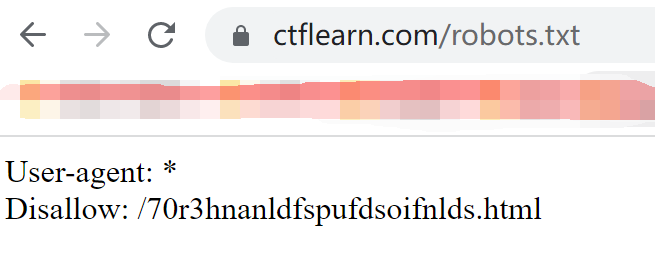
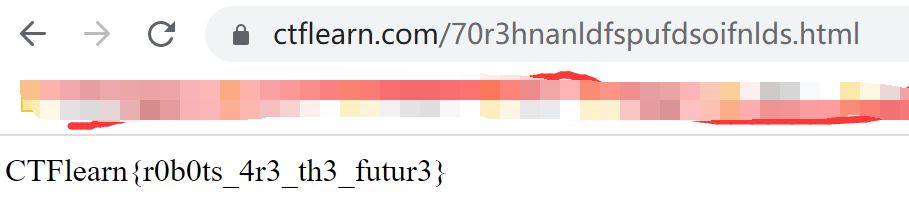

## Wikipedia
> Not much to go off here, but it’s all you need: Wikipedia and 128.125.52.138.

挂梯子上维基百科。搜索128.125.52.138，发现

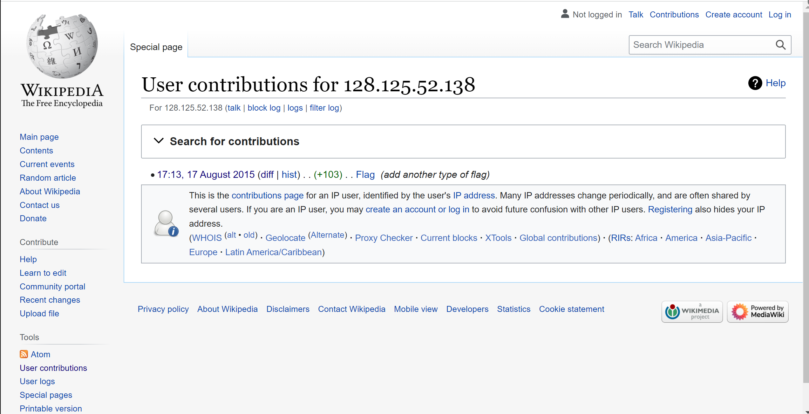

点击 `diff` 查看历史版本，发现flag：

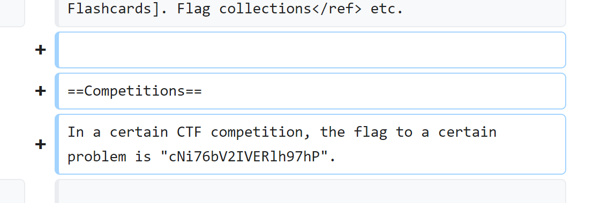

## 进制十六--参上
给一幅图片，用ocr扫描（我用的是白描），得到flag的十六进制码：666C61677B5930555F5348305531445F6B6E30775F4830575F74305F43306E763372745F4845585F746F5F546578547D。在CyberChef里面转回原码：flag{Y0U_SH0U1D_kn0w_H0W_t0_C0nv3rt_HEX_to_TexT}
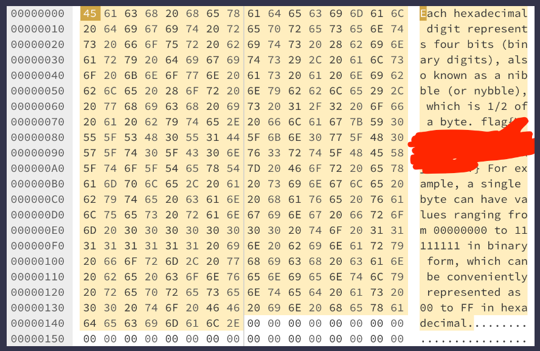

## fixme1.py ~ fixme2.py
> Fix the syntax error in the Python script to print the flag.

这两题都是简单地纠正了一下语法小错误，再跑一下就得到了flag。

## 猫咪问答 Pro Max
> 我猛然一看，就猛然看到这个猫咪问答，我直呼我直呼，上次看到这么这么的发言还是上次，这问答属于是典型的典型了，我之前还没发现，当我发现的时候我已经发现了，这问答就像一个问答，问答的内容充满了内容，我不禁感慨了一句感慨：希望下次看到这么这么的猫咪问答是下次。\
> 提示：解出谜题不需要是科大在校学生。解题遇到困难？你可以参考 [2018 年猫咪问答题解](https://github.com/ustclug/hackergame2018-writeups/blob/master/official/ustcquiz/README.md) 和 [2020 年猫咪问答++](https://github.com/USTC-Hackergame/hackergame2020-writeups/blob/master/official/%E7%8C%AB%E5%92%AA%E9%97%AE%E7%AD%94++/README.md) 题解。\
> http://202.38.93.111:10001 \
> Token: 1:MEQCIBY0ubN3BOXYsuRdXzqWIWNf8Jx0Y6giZCSp/Rg8zdNwAiBMZGWaiIGLD33KTfQ5TTLejp9PwGp8Gg4HsJbdo8sVig==

查看提示给的两个题解，发现考的是搜索引擎的用法。直接查。

第一题：
> 1. 2017 年，中科大信息安全俱乐部（SEC@USTC）并入中科大 Linux 用户协会（USTCLUG）。目前，信息安全俱乐部的域名（sec.ustc.edu.cn）已经无法访问，但你能找到信息安全俱乐部的社团章程在哪一天的会员代表大会上通过的吗？
>> 提示：输入格式为 YYYYMMDD，如 20211023。请不要回答 “能” 或者 “不能”。

在 [codes [SEC@USTC]](https://lug.ustc.edu.cn/wiki/sec/codes.html) 可以找到是 ``20150504``

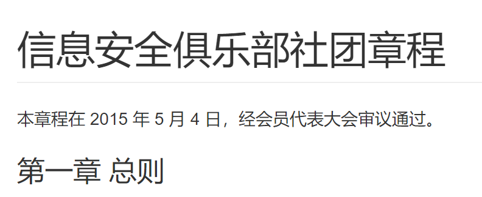

第二题：
> 2. 中国科学技术大学 Linux 用户协会在近五年多少次被评为校五星级社团？
>> 提示：是一个非负整数。

在 [中国科学技术大学 Linux 用户协会 - LUG @ USTC](https://lug.ustc.edu.cn/wiki/intro/) 可以找到是 ``5``（看起来是`6`但是试了下是错的）

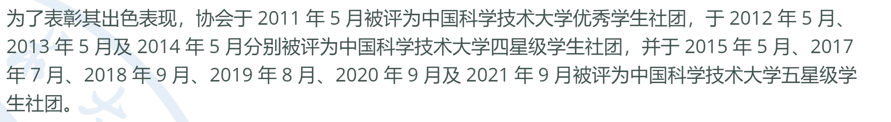

第三题：
> 3. 中国科学技术大学 Linux 用户协会位于西区图书馆的活动室门口的牌子上“LUG @ USTC”下方的小字是？
>> 提示：正确答案的长度为 27，注意大小写。

在LUG官网查找西区图书馆。可以找到是 ``Development Team of Library``

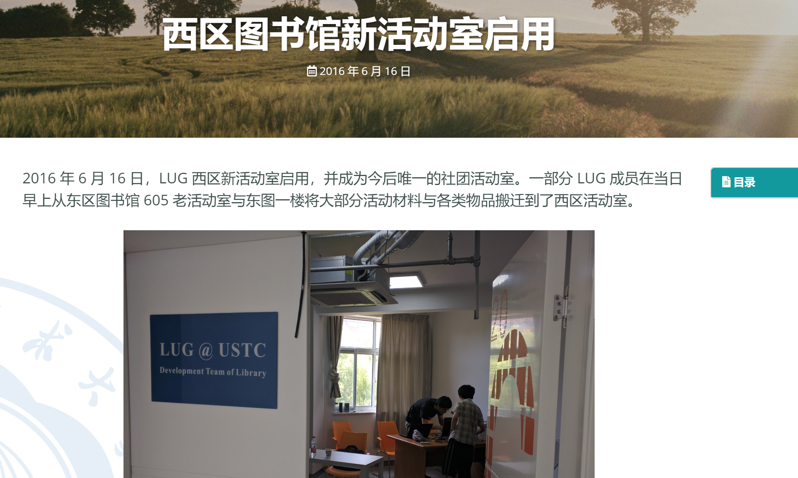

第四题：
> 4. 在 SIGBOVIK 2021 的一篇关于二进制 Newcomb-Benford 定律的论文中，作者一共展示了多少个数据集对其理论结果进行验证？
>> 提示：是一个非负整数。

搜索 SIGBOVIK 2021 找到 [论文集](http://sigbovik.org/2021/proceedings.pdf)，文内搜索 Newcomb-Benford，发现一共展示了 ``13`` 个数据集（图2-14）。

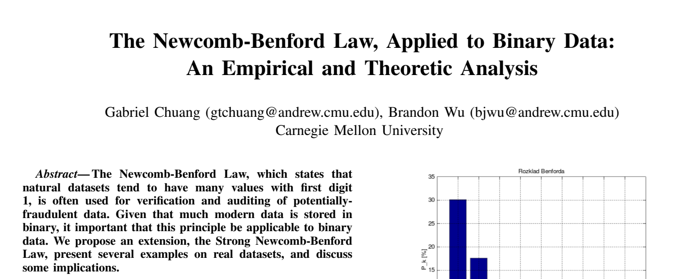

第五题：
> 5. 不严格遵循协议规范的操作着实令人生厌，好在 IETF 于 2021 年成立了 Protocol Police 以监督并惩戒所有违背 RFC 文档的行为个体。假如你发现了某位同学可能违反了协议规范，根据 Protocol Police 相关文档中规定的举报方法，你应该将你的举报信发往何处？
>>提示：正确答案的长度为 9。

搜索 Protocol Police IETF，找到 [RFC8962](https://datatracker.ietf.org/doc/html/rfc8962)

查阅六条，知是 ``/dev/null``

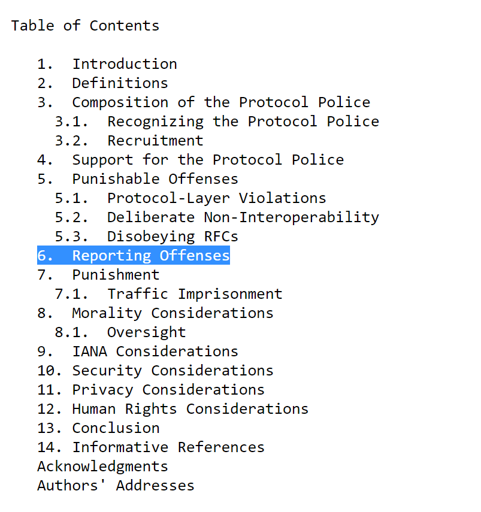

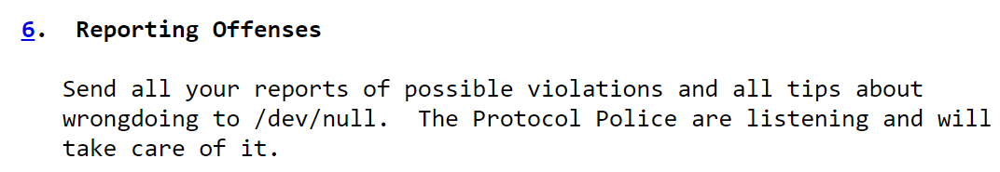

提交所有答案，得flag：flag{8804d9f3_814979b444}

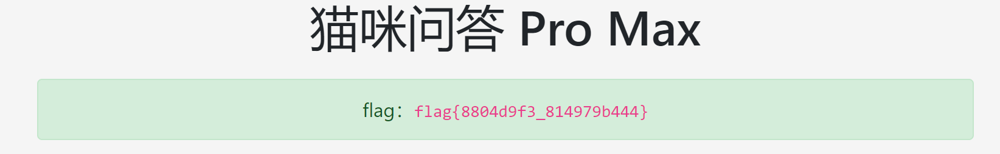

## 旅行照片
> 你的学长决定来一场说走就走的旅行。通过他发给你的照片来看，他应该是在酒店住下了。
> 
> 从照片来看，酒店似乎在小区的一栋高楼里，附近还有一家 KFC 分店。突然，你意识到照片里透露出来的信息比表面上看起来的要多。
>
> 请观察照片并答对全部 5 道题以获取 flag。注意：图片未在其他地方公开发布过，也未采取任何隐写措施（通过手机拍摄屏幕亦可答题）。
>
> http://202.38.93.111:10055/
>
> Token: 1:MEQCIBY0ubN3BOXYsuRdXzqWIWNf8Jx0Y6giZCSp/Rg8zdNwAiBMZGWaiIGLD33KTfQ5TTLejp9PwGp8Gg4HsJbdo8sVig==

考的也是搜索引擎的使用。找得很麻烦。

## 卖瓜
> 补充说明：当称的数字变为浮点数而不是整数时，HQ 不会认可最终的称重结果。
>
> http://202.38.93.111:15003
>
> Token: 1:MEQCIBY0ubN3BOXYsuRdXzqWIWNf8Jx0Y6giZCSp/Rg8zdNwAiBMZGWaiIGLD33KTfQ5TTLejp9PwGp8Gg4HsJbdo8sVig==

考的是php的整数溢出（[PHP: Integer 整型 - Manual](https://www.php.net/manual/zh/language.types.integer.php)），给定的一个数超出了 int 的范围，将会被解释为 float。当总重量超过 $2^{63}$ 时溢出，溢出后会变成负数，凑数就好。

得flag：flag{HUAQIANG!HUAQIANG!_72186c8adf}

## Time Traveller
> Let's take a trip to nasa.gov on December 31, 1996. If you can tell me what email NASA listed on their website, I'll provide you with points.
>
> Format: CTFlearn{email}

挂梯子谷歌搜 wayback machine，可以看网页某个时刻的快照。

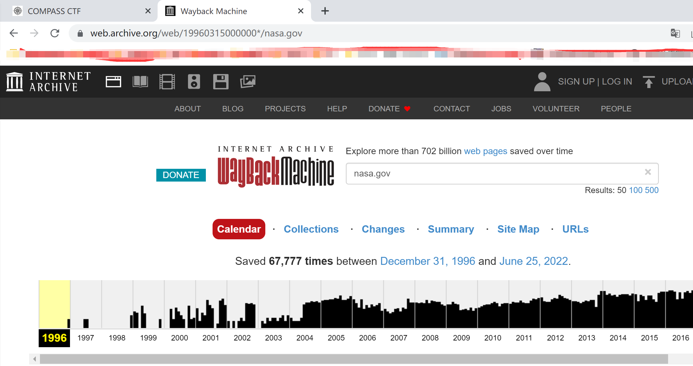

在 wayback machine 里搜 nasa.gov，找到1996年12月31日的快照。看到一个邮箱地址（？），由flag格式提示猜测应该就是flag：CTFlearn{today@nasa.gov}。提交果真如此。

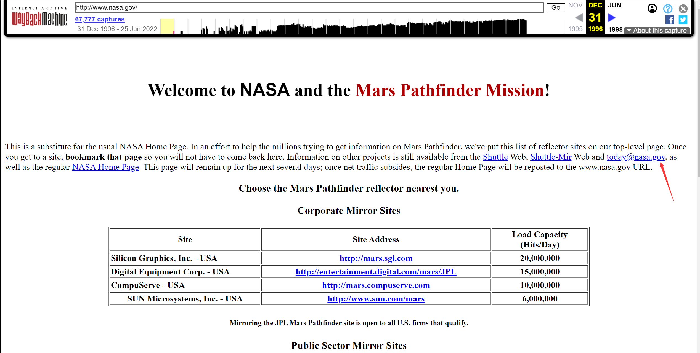

## PW Crack 1 ~ 5
均是简单的遍历破解，注意 PW Crack 5 要去除每行密码的左右空格。

## Command Challenge
> View [Command Challenge](https://cmdchallenge.com/) and finish the challenges.
>
> The flag is the message shows on the screen after you finish all challenges. (includes emoji)

打开网页，要求用linux的命令做题。好难，好多都不会解，google查答案了。解完第一个是这样，flag即🎉 Congrats, you completed the challenge! 🎉

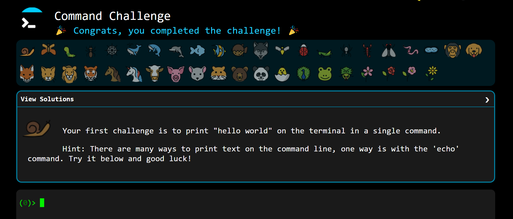