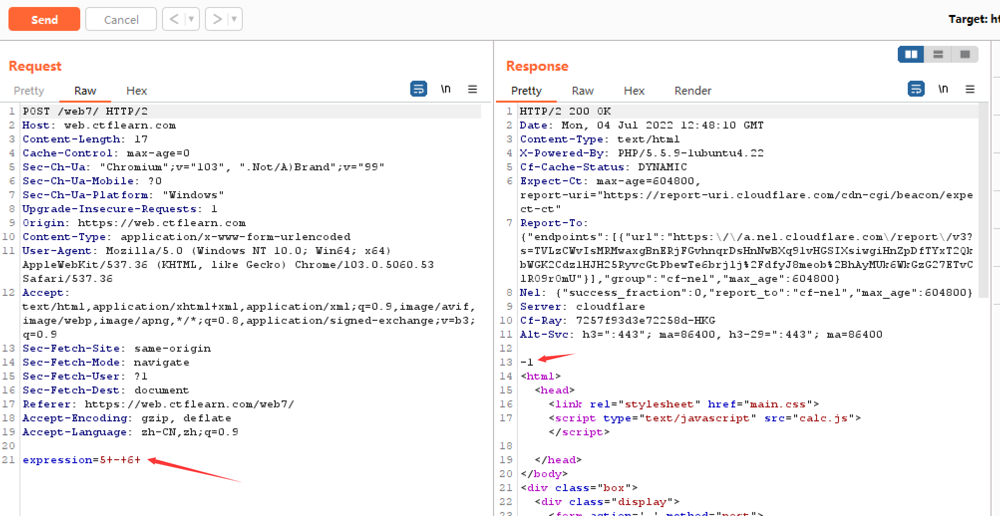
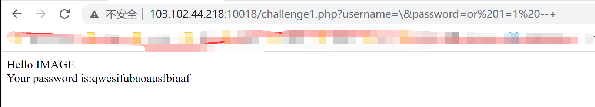
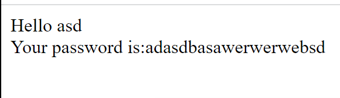

# 2022 Summer Training 2
## web签到题
> web签到题
>
> http://103.102.44.218:10015/

打开网站，F12开发者模式，在Sources里面有一串密文


是bases64编码，拖到CyberChef里，解码后得flag：ctfshow{4bf53e70-6c36-4bb1-9ca1-c9798d95f40f}

## Basic Injection
> See if you can leak the whole database using what you know about SQL Injections. [link](https://web.ctflearn.com/web4/)
>
> Don't know where to begin? Check out [CTFlearn's SQL Injection Lab](https://ctflearn.com/lab/sql-injection-part-1)

基本的SQL注入。点开链接


由下面两行查询语句提示可知，是最基本的单引号注入。输入 `a' OR '1'='1` 并提交，看到网站返回了一系列数据，里面就有flag：CTFlearn{th4t_is_why_you_n33d_to_sanitiz3_inputs}


## POST Practice
> This website requires authentication, via POST. However, it seems as if someone has defaced our site. Maybe there is still some way to authenticate? http://165.227.106.113/post.php

打开链接，F12，查看源码。


里面给了用户名和密码。根据网页的提示，用ApiPost或者Postman对该网站发POST即可（我用的是ApiPost）得flag：flag{p0st_d4t4_4ll_d4y}


当然，也可以用python的request包发送请求，一样得到flag。

```python
import requests

info = {
    "username": "admin",
    "password": "71urlkufpsdnlkadsf"
}
res = requests.post("http://165.227.106.113/post.php", data=info)
print(res.text)

```


## Don't Bump Your Head(er)
> Try to bypass my security measure on this site! http://165.227.106.113/header.php

打开链接，F12，查看源码。


说是我的user agent不正确，要是Sup3rS3cr3tAg3nt才行。User-Agent是一个特殊字符串头，是一种向访问网站提供你所使用的浏览器类型及版本、操作系统及版本、浏览器内核、等信息的标识。

打开Burp Suite，打开浏览器，打开拦截。


拦截请求后send to repeater，修改User-Agent为 `Sup3rS3cr3tAg3nt` 并发送。


这次说我不是来自网站 awesomesauce.com 。

Referer是HTTP请求header中的一部分，其表示请求当前资源的客户端来源，当浏览器（或模拟浏览器行为）向web服务器发送请求的时候，头部信息里会携带Referer。（虽然英语标准拼写应该是Referrer，但是因为历史事故就将错就错了）

因此，修改Referer为 `awesomesauce.com` 重新发送。


得到flag：flag{did_this_m3ss_with_y0ur_h34d}

## Calculat3 M3
> Here! http://web.ctflearn.com/web7/ I forget how we were doing those calculations, but something tells me it was pretty insecure.

打开链接，F12，查看源码。有一个.js文件，点开看看。


看起来前两个函数是对一个变量赋值修改，然后第三个函数将这个变量放到eval()中执行。

上网搜 [js 中 document.getElementById() 的用法](https://blog.csdn.net/qq_47776903/article/details/123201271)，这个函数用于返回具有指定ID属性值的第一个对象。似乎对解题没什么用。

打开Burp Suite。随便输一个计算5-6，拦截得



发送这个请求后会返回-1。猜测eval()应该是接收了这个expression并计算出了值。试试修改expression=;ls再发送，得到flag：ctf{watch_0ut_f0r_th3_m0ng00s3}


## php audit
> What's the meaning of the php code?
>
> http://103.102.44.218:10017/

打开链接，是一串php代码。


preg_match()用于在目标字符串中搜索指定的正则表达式，只匹配一次，匹配上了就马上停止搜索返回结果（匹配为1，不匹配为0）。

[正则表达式](https://www.liaoxuefeng.com/wiki/1252599548343744/1304066080636961)（或[正则表达式](http://www.manongjc.com/detail/19-drwywkgchmouszp.html)）中 `/^` 匹配输入字符串的开始位置，`$/` 匹配输入字符串的结尾位置， `\w+` 匹配 0 - 9、A - Z、a - z 中任意字符一次或多次。

这个不是关键，主要要看 `eval("var_dump($$args);");` 。eval()能将字符串的字面值当作代码执行，这里也即执行 `var_dump($string);` ，其中string = \$args。var_dump能将变量的类型、内容与结构打印出来。由上面的正则匹配，猜测这个变量是 `$GLOBALS` （因为[php的超级全局变量](https://www.runoob.com/php/php-superglobals.html)里面只有这个没下划线）


果然，得到flag：flag{GE7_fl4g_w17h_GL0B4L}

## Execute?
> Cool, to prevent the command injection, I decide to filter the input.
>
> It's secure enough.
> 
> http://103.102.44.218:10016/

打开链接，F12，查看源码。


提示可以通过 `exec.php?view_source` 查看php源码。在链接后输入然后回车。


可以看到，这个php程序是从\$_REQUEST表单中接收了名为ip的值，将ip中的一些字符筛选后与'ping '拼接再作为shell指令执行。主要思路是如何利用php的字符串拼接绕过来执行如ls等的命令，从而看到服务器的数据。

由于筛选列表里将 & | - ; \` \$ ( ) 都筛掉了，所以不能通过常见的方式绕过。（[参考1](https://www.cnblogs.com/tony1314/p/8315666.html)、[参考2](https://book.hacktricks.xyz/pentesting-web/command-injection)；参考2非常好用）
* a|b, a||b 同时执行a，b；
* a&b 同时执行a，b，但只能看到b的执行结果；
* a&&b 当a成功执行时执行b；
* -a 与&&等价，-o 与||等价；
* a;b 执行完a后无论结果，执行b（链式执行）；
* \`a\` 与 \$(a) 等价，如执行cat \`ls\` 时，先执行 ls，假设获得 a.txt，再返回得命令 cat a.txt，最后打开 a.txt 文件）。

当然，使用URL编码（&为%26，|为%7c）或许是一个思路，但是这里显然也是不行的。

在这里可以使用%0a（回车换行符）（[在一些协议如http和ftp里%0a可以是一个新的命令的开始](https://www.cnblogs.com/allyesno/archive/2007/06/29/800139.html)，[%0a绕过XSS防御](https://www.cnblogs.com/Qiuzhiyu/p/12687756.html)）, a %0a b 能同时执行a和b。

如图，随便指定ip的值，将ping出的结果用>重定向到一个txt文件中，用%0a同时执行ls命令。看到有三个文件，flag应该就在flag.php中。


用cat flag.php打开，没有什么变化。用grep flag flag.php筛选，得flag：flag{C0mm4nd_3x3cu7i0n}


## why sqli?
> How can you inject without quotes?
>
> http://103.102.44.218:10018/

打开链接，看到php代码。


先通过\$_GET获取'username'和'password'的值，然后放入clean()中处理（[@是为了阻止函数的报错](https://zhidao.baidu.com/question/221039917.html)）。

clean()函数解读：

* get_magic_quotes_gpc() 能取得 PHP 环境配置的变量 magic_quotes_gpc (GPC, Get/Post/Cookie) 值。返回 0 表示关闭本功能；返回 1 表示本功能打开。当 magic_quotes_gpc 打开时，所有的 ' (单引号), " (双引号), \ (反斜杠) 和 ' ' (空字符)会自动转为含有反斜杠的溢出字符。（[php中get_magic_quotes_gpc()函数说明](https://blog.csdn.net/xiaoxinshuaiga/article/details/80208427)）
* stripslashes() 会删除由 addslashes() 函数添加的反斜杠。[PHP stripslashes() 函数](https://www.runoob.com/php/func-string-stripslashes.html)）即 
  ```php
  <?php
    $str1 = "Who\'s Peter Griffin?";
    $str2 = stripslashes($str1);
    echo $str1;
    echo PHP_EOL;
    echo $str2;
    /*
        Who\'s Peter Griffin?
        Who's Peter Griffin?
    */
  ?>
  ```
* htmlentities() 函数把字符转换为 HTML 实体。（[PHP htmlentities() 函数](https://www.runoob.com/php/func-string-htmlentities.html)）即
  ```php
  <?php
    $str1 = "Jane & 'Tarzan'";
    $str2 = htmlentities($str1, ENT_QUOTES); // Converts double and single quotes
    echo $str1;
    echo PHP_EOL;
    echo $str2;
    /*
        Jane & 'Tarzan'
        Jane &amp; &#039;Tarzan&#039;
    */
  ?>
  ```
也就是说，所有的利用单双引号注入的方法在这里都是不行的。看php代码中的查询语句，是字符型的注入类型（嵌入的变量两边都被引号包围）。
```php
$query='SELECT * FROM users WHERE name=\''.$username.'\' AND pass=\''.$password.'\';';
```
需要构造 \$username 和 \$password 来绕过包围的引号的限制。尝试（其中%20是URL编码，即空格）
```url
?username=\&password=or%201=1%20--+
```
因为这样会构造出如下的查询语句
```sql
SELECT * FROM users WHERE name='\' AND pass='or 1=1 --';
```
注意到这里的条件是 `name` = `\' AND pass=` or `1=1` ，由于 `1=1` ，这个条件是恒真的；而后面的 `--` 将其后的内容注释掉了。也就是说，这个查询等价于
```sql
SELECT * FROM users
```


似乎是有效的，返回了用户名和密码。但是这些信息似乎没什么用。

由
```php
if(!$result || mysql_num_rows($result) < 1)
```
估计users这个表应该还挺大的，但是每次只能显示一个用户（也即一行），或许需要筛选一下？

猜用户名应该是flag（或者admin），构造如下（及对应的查询语句和等价语句）（其中%27是URL编码，即 ' （单引号））
```url
?username=\&password=or%201=1%20and%20%27username=%27flag%27%27%20--+
```
```sql
SELECT * FROM users WHERE name='\' AND pass='or 1=1 and name='flag'--';
```
```sql
SELECT * FROM users WHERE name='flag'
```
很可惜不行，或许是构造错了？

既然如此，那就暴力一行一行查，构造如下（及等价语句）（第一行）
```url
?username=admin\&password=or%201=1%20limit%201%20offset%201%20--+--+
```
```sql
SELECT * FROM users LIMIT 1 OFFSET 1
```



（第二行）
```url
?username=admin\&password=or%201=1%20limit%201%20offset%202%20--+--+
```
```sql
SELECT * FROM users LIMIT 1 OFFSET 2
```


好！得flag：flag{mysqli_hooray}