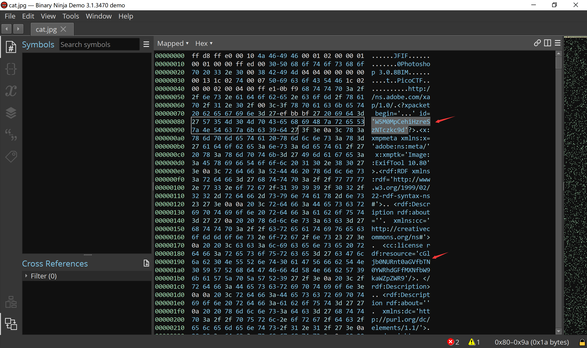
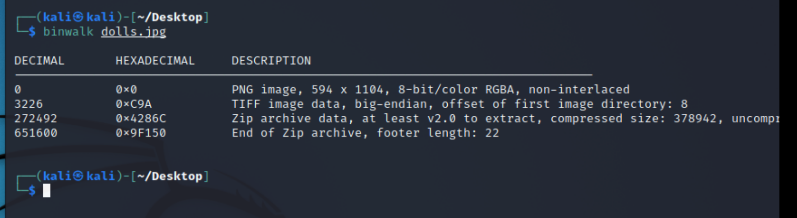
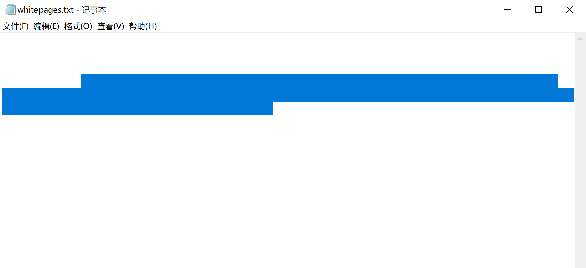
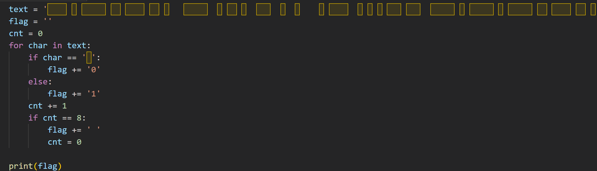
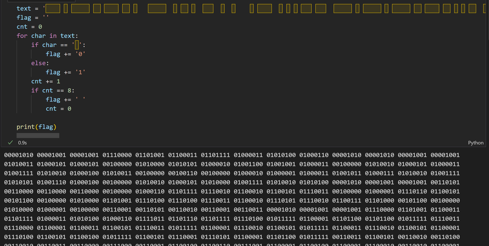
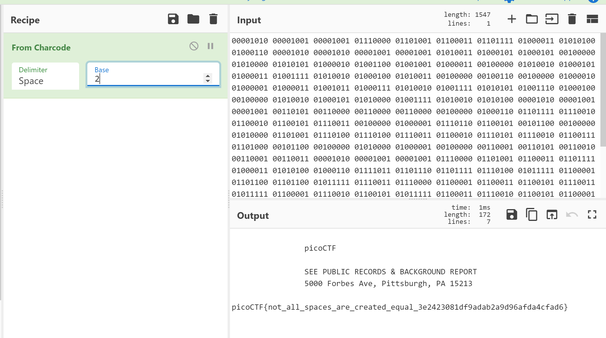
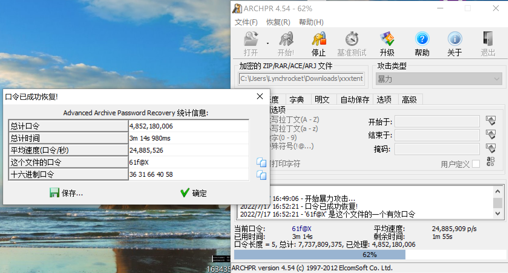

# 2022 Summer Training 4
## Information
> Files can always be changed in a secret way. Can you find the flag?

用binary ninja打开，发现有两串字符串比较可疑：`W5M0MpCehiHzreSzNTczkc9d` 和 `cGljb0NURnt0aGVfbTN0YWRhdGFfMXNfbW9kaWZpZWR9`。



第一串似乎没有什么意义，但是第二串可用base64解码，得flag：picoCTF{the_m3tadata_1s_modified}

## Matryoshka doll
> Matryoshka dolls are a set of wooden dolls of decreasing size placed one inside another. What's the final one?

下载图片后拖到kali中，用 `binwalk dolls.jpg` 查看。



有隐藏的压缩文件。用 `binwalk -e dolls.jpg` 获取隐藏文件。得到还是一个叫 2_c.jpg 的文件，继续用 `binwalk -e 2_c.jpg`，得到 3_c.jpg 文件。继续得 4_c.jpg 文件。最后得到一个flag.txt文件，得flag（注意删掉空格）：picoCTF{4cf7ac000c3fb0fa96fb92722ffb2a32}

## WhitePages
> I stopped using YellowPages and moved onto WhitePages... but the page they gave me is all blank!

下载下来是一个txt文件，打开似乎什么都没有，但是选中一下发现是有东西的。



将内容复制到python程序中，如下所示



虽然看起来像是空格，但其实是一些不能看见的字符。输出后如下所示。



在 [Binary to Text Translator](https://www.rapidtables.com/convert/number/binary-to-ascii.html) 中将结果转成字符，得flag：picoCTF{not_all_spaces_are_created_equal_3e2423081df9adab2a9d96afda4cfad6}



## weak password
> The password of compressed file is a five-byte printable characters.
>
> What is LSB? I'm not LSB! But there is something in the LSB.
> 
> The flag contains 5 blank spaces, 2 commas, replace them all with underline (reserve 1 underline if multiple are in continuous).

下载附件，用 ARCHAPR 爆破（根据提示是5位的可打印字符）得到压缩密码：61f@X。



打开来里面是一张图片。


## like1000
> This .tar file got tarred a lot.

压缩了一千层的tar文件。

```python
import tarfile

for i in range(1000, 0, -1):
	filename = str(i) + '.tar' 
	tar = tarfile.open(filename) 
	tar.extractall() 
	tar.close() 

print('finish')
```

得flag：picoCTF{l0t5_0f_TAR5}


## upper-lower case
> In a past event, I'm working on the challenges with Frankss and monad. We are very close to the answer, with only one little problem: we don't know the upper/lower case of the final flag.
>
> So, let's try to guess it.
>
> Possible flag: y0u_re4lly_kn0w_th1s_congr4tulat10ns
>
> MD5 of the correct flag: 7513209051f455fa44d0fa5cd0f3e051


## 