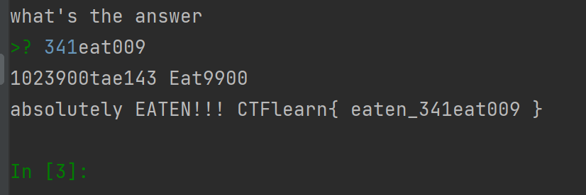
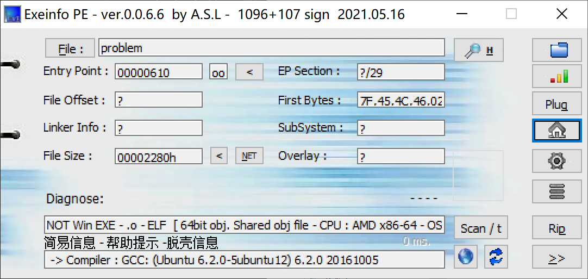
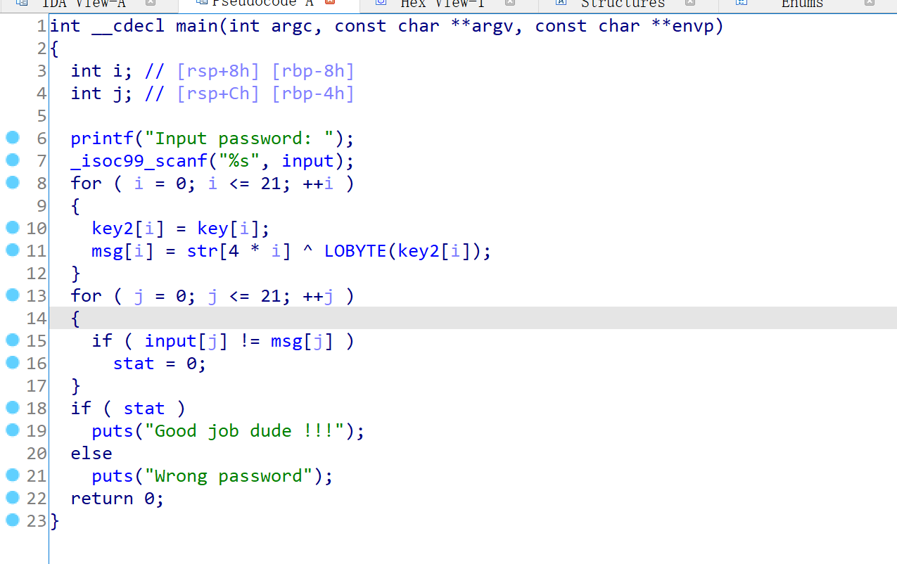
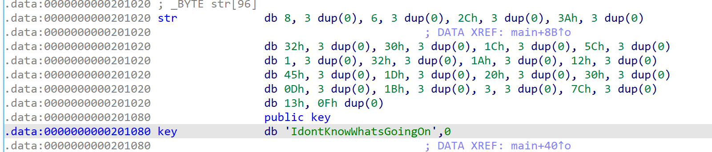
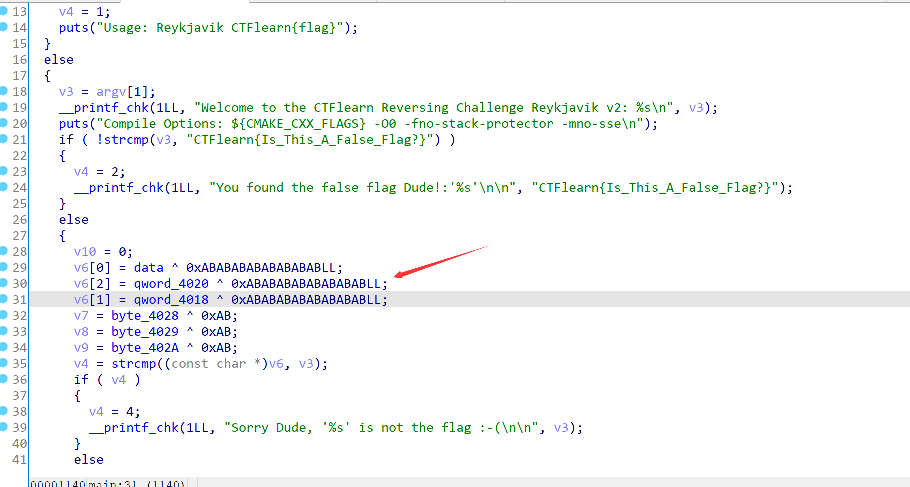
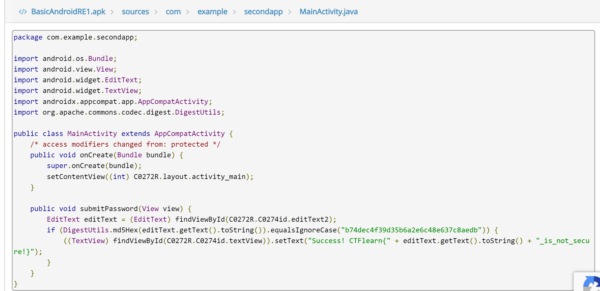
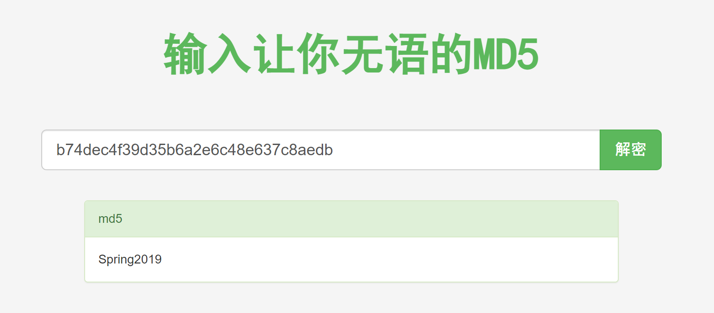

# 2022 Summer Training 3
## Time to Eat
> My friend sent me some Python code, but something tells me he was hungry when he wrote it. Do you think you can put your reverse engineering skills to use and get it to output the flag?

下载附件，是一个py脚本
```python
# I wrote and debugged this code with all the convoluted "EAT" variable names.
# Was it confusing? Yes. Was debugging hard? Yes.
# Did I spend more time than I should have on this problem? Yes

EAT = int
eAT = len
EaT = print
ATE = str
EATEATEATEATEATEAT = ATE.isdigit

def Eating(eat):
    return ATE(EAT(eat)*EATEATEAT)

def EAt(eat, eats):
    print(eat, eats)
    eat1 = 0
    eat2 = 0
    eateat = 0
    eAt = ""
    while eat1 < eAT(eat) and eat2 < eAT(eats):
        if eateat%EATEATEAT == EATEATEATEATEAT//EATEATEATEAT:
            eAt += eats[eat2]
            eat2 += 1
        else:
            eAt += eat[eat1]
            eat1 += 1
        eateat += 1
    return eAt

def aten(eat):
    return eat[::EATEATEAT-EATEATEATEAT]

def eaT(eat):
    return Eating(eat[:EATEATEAT]) + aten(eat)

def aTE(eat):
    return eat#*eAT(eat)

def Ate(eat):
    return "Eat" + ATE(eAT(eat)) + eat[:EATEATEAT]

def Eat(eat):
    if eAT(eat) == 9:
        if EATEATEATEATEATEAT(eat[:EATEATEAT]) and\
            EATEATEATEATEATEAT(eat[eAT(eat)-EATEATEAT+1:]):
                eateat = EAt(eaT(eat), Ate(aTE(aten(eat))))
                if eateat == "E10a23t9090t9ae0140":
                    flag = "eaten_" + eat
                    EaT("absolutely EATEN!!! CTFlearn{",flag,"}")
                else:
                    EaT("thats not the answer. you formatted it fine tho, here's what you got\n>>", eateat)
        else:
            EaT("thats not the answer. bad format :(\
            \n(hint: 123abc456 is an example of good format)")
    else:
        EaT("thats not the answer. bad length :(")

EaT("what's the answer")
eat = input()
EATEATEAT = eAT(eat)//3
EATEATEATEAT = EATEATEAT+1
EATEATEATEATEAT = EATEATEAT-1
Eat(eat)
```

在pycharm里面替换字符串并整理一下，得到：

```python
# I wrote and debugged this code with all the convoluted "EAT" variable names.
# Was it confusing? Yes. Was debugging hard? Yes.
# Did I spend more time than I should have on this problem? Yes


def fun1(eat):
    return str(int(eat) * 3)


def fun2(eat, eats):
    print(eat, eats)
    eat1 = 0
    eat2 = 0
    eateat = 0
    eAt = ""
    while eat1 < len(eat) and eat2 < len(eats):
        if eateat % 3 == 0:
            eAt += eats[eat2]
            eat2 += 1
        else:
            eAt += eat[eat1]
            eat1 += 1
        eateat += 1
    return eAt


def fun3(eat):
    return eat[::-1]


def fun4(eat):
    return fun1(eat[:3]) + fun3(eat)


def fun5(eat):
    return eat  # *len(eat)


def fun6(eat):
    return "Eat" + str(len(eat)) + eat[:3]


def fun7(eat):
    if len(eat) == 9:
        if str.isdigit(eat[:3]) and str.isdigit(eat[7:]):  # 前三位和最后三位都是数字
            eateat = fun2(fun4(eat), fun6(eat[::-1]))
            if eateat == "E10a23t9090t9ae0140":
                flag = "eaten_" + eat
                print("absolutely EATEN!!! CTFlearn{", flag, "}")
            else:
                print("thats not the answer. you formatted it fine tho, here's what you got\n>>", eateat)
        else:
            print("thats not the answer. bad format :(\
            \n(hint: 123abc456 is an example of good format)")
    else:
        print("thats not the answer. bad length :(")


print("what's the answer")
eat = input()
fun7(eat)
```

稍作分析可知，输入应当是9位字符串，而且前三位和最后三位都是数字，中间三位为字母。

分析fun2后，可以通过下面的脚本获取eat和eats，分别为`1023900tae14` 和 `Eat9900` 。

```python
eateat = "E10a23t9090t9ae0140"
print(len(eateat))
eat, eats = '', ''
for i in range(len(eateat)):
    if i % 3 == 0:
        eats += eateat[i]
    else:
        eat += eateat[i]
print(eat, ' ', eats)
print(len(eat), ' ', len(eats))
```

注意到 `eateat = fun2(fun4(eat), fun6(eat[::-1]))` ,因此 `eat == fun4(eat)` 且 `eats == fun6(eat[::-1])` ，即 `'1023900tae14' == fun1(eat[:3]) + fun3(eat)` 且 `'Eat9900' == "Eat" + str(len(eat)) + eat[:3]`

通过继续分析可知，输入的应该是 `341eat009` 。运行程序并输入可得flag：CTFlearn{ eaten_341eat009 }



## RE_verseDIS
> Could you find the hidden password?

用Exeinfo查壳，64位无壳



用ida64打开，能直接f5看伪代码。



主要是通过str和key的异或操作获取flag，双击进入查看这两个变量的值。



str可以通过选中后Edit->Export Data导出。根据伪代码可以写出脚本。（对LOBYTE这个函数或许有点疑惑，其实就是获取变量的低8位的值，由于这里的key2是ascii英文字符，低8位跟原值其实一样）

```python
str_list = [
    8, 0, 0, 0, 6, 0, 0, 0, 44, 0,
    0, 0, 58, 0, 0, 0, 50, 0, 0, 0,
    48, 0, 0, 0, 28, 0, 0, 0, 92, 0,
    0, 0, 1, 0, 0, 0, 50, 0, 0, 0,
    26, 0, 0, 0, 18, 0, 0, 0, 69, 0,
    0, 0, 29, 0, 0, 0, 32, 0, 0, 0,
    48, 0, 0, 0, 13, 0, 0, 0, 27, 0,
    0, 0, 3, 0, 0, 0, 124, 0, 0, 0,
    19, 0, 0, 0, 0, 0, 0, 0, 0, 0,
    0, 0, 0, 0, 0, 0
]
key = b'IdontKnowWhatsGoingOn'
for i in range(0, 21):
    res = str_list[4 * i] ^ key[i]
    print(chr(res), end='')
```

运行即得flag：AbCTF{r3vers1ng_dud3}

## Reykjavik
> Good beginning Reversing challenge - jump into gdb and start looking for the flag!

下载附件，用Exeinfo查壳。64位无壳。用ida64打开，可以直接f5生成伪代码。



关键在于这几行异或。

```python
v6 = [0, 0, 0, 0, 0, 0]

data = 0xC5D9CACEC7EDFFE8
qword_4018 = 0xDD9BE7F4CED2EED0
qword_4020 = 0xC5CAC7CEC8E2F4CE

byte_4028 = 0xCF
byte_4029 = 0xF4
byte_402A = 0xD6

v6[0] = data ^ 0xABABABABABABABAB
v6[2] = qword_4020 ^ 0xABABABABABABABAB
v6[1] = qword_4018 ^ 0xABABABABABABABAB
v6[3] = byte_4028 ^ 0xAB
v6[4] = byte_4029 ^ 0xAB
v6[5] = byte_402A ^ 0xAB

for i in v6:
    pi = i
    while pi:
        tmp = pi % 256
        print('%#x' % tmp, end='')
        pi //= 256
```

运行这个脚本可得flag：CTFlearn{Eye_L0ve_Iceland_}

## Transformation
> I wonder what this really is...
>
> ''.join([chr((ord(flag[i]) << 8) + ord(flag[i + 1])) for i in range(0, len(flag), 2)])

给了一个附件，内容是

```
灩捯䍔䙻ㄶ形楴獟楮獴㌴摟潦弸強㕤㐸㤸扽
```

看一下题目给的代码，意思是将原flag每两位为一组，flag\[i\]在高8位，flag\[i+1\]在低8位，16位组成新的unicode字符。

```python
# ''.join([chr((ord(flag[i]) << 8) + ord(flag[i + 1])) for i in range(0, len(flag), 2)])

line = '灩捯䍔䙻ㄶ形楴獟楮獴㌴摟潦弸強㕤㐸㤸扽'

flag = ''

for x in line:
    lo = ord(x) % 256
    hi = (ord(x) >> 8)
    flag += (chr(hi) + chr(lo))

print(flag)
```

运行可得flag：picoCTF{16_bits_inst34d_of_8_75d4898b}

## PIN
> Can you crack my pin?

用ida64打开，main->cek->valid:333333就是flag了？!

## Bite-code
> I dunno what bytecode is. Could you tell me what input of 'checkNum' will return true? The flag is just a 32-bit signed integer as a decimal (nothing else.)

给一个txt文件，内容是一些java字节码
```java
public static boolean checkNum(int);
    descriptor: (I)Z
    flags: ACC_PUBLIC, ACC_STATIC
    Code:
      stack=2, locals=3, args_size=1
         0: iload_0
         1: iconst_3
         2: ishl
         3: istore_1
         4: iload_0
         5: ldc           #2                  // int 525024598
         7: ixor
         8: istore_2
         9: iload_1
        10: iload_2
        11: ixor
        12: ldc           #3                  // int -889275714
        14: if_icmpne     21
        17: iconst_1
        18: goto          22
        21: iconst_0
        22: ireturn
      LineNumberTable:
        line 3: 0
        line 4: 4
        line 5: 9
      StackMapTable: number_of_entries = 2
        frame_type = 253 /* append */
          offset_delta = 21
          locals = [ int, int ]
        frame_type = 64 /* same_locals_1_stack_item */
          stack = [ int ]
```

第一行 `public static boolean checkNum(int);` 是方法头。

`descriptor` 描述的是该方法的形参和返回值。此处形参有一个，且类型是int类型，返回值是boolean类型（I表示int， Z表示boolean)。

`flags` 描述该方法的访问修饰。ACC_PUBLIC表示该方法是public，ACC_STATIC表示该方法是static。

`code` 描述了该方法的指令，JVM是基于堆栈来实现指令的执行的。

`stack`表示栈的深度，`locals`表示局部变量的个数，`args_size`表示形参的个数。

对这个字节码逐行辨认可知其意思。

```java
public static boolean checkNum(int x) {
    n1 = 525024598
    n2 = -889275714
    n3 = (x << 3) ^ (x ^ n1)
    if (n3 == n2) {
        return true;
    }
    else
        return false;
}
```

可以通过如下脚本暴力破解返回true时x的值（32位）

```java
public class Solution {
    public static void main(String[] args) {
        int n1 = 525024598;
        int n2 = -889275714;

        for (int i = Integer.MIN_VALUE; i < Integer.MAX_VALUE; i++) {
            int n3 = (i << 3) ^ (n1 ^ i);
            if (n3 == n2) {
                System.out.println(i);
                break;
            }
        }
    }
}
```

最终为 -1352854872

## keygenme-py

给一个py附件。下载后主要看几个变量和两个函数。

```python
username_trial = "SCHOFIELD"
bUsername_trial = b"SCHOFIELD"

key_part_static1_trial = "picoCTF{1n_7h3_|<3y_of_"
key_part_dynamic1_trial = "xxxxxxxx"
key_part_static2_trial = "}"
key_full_template_trial = key_part_static1_trial + key_part_dynamic1_trial + key_part_static2_trial

def enter_license():
    user_key = input("\nEnter your license key: ")
    user_key = user_key.strip()

    global bUsername_trial
    
    if check_key(user_key, bUsername_trial):
        decrypt_full_version(user_key)
    else:
        print("\nKey is NOT VALID. Check your data entry.\n\n")


def check_key(key, username_trial):

    global key_full_template_trial

    if len(key) != len(key_full_template_trial):
        return False
    else:
        # Check static base key part --v
        i = 0
        for c in key_part_static1_trial:
            if key[i] != c:
                return False

            i += 1

        # TODO : test performance on toolbox container
        # Check dynamic part --v
        if key[i] != hashlib.sha256(username_trial).hexdigest()[4]:
            return False
        else:
            i += 1

        if key[i] != hashlib.sha256(username_trial).hexdigest()[5]:
            return False
        else:
            i += 1

        if key[i] != hashlib.sha256(username_trial).hexdigest()[3]:
            return False
        else:
            i += 1

        if key[i] != hashlib.sha256(username_trial).hexdigest()[6]:
            return False
        else:
            i += 1

        if key[i] != hashlib.sha256(username_trial).hexdigest()[2]:
            return False
        else:
            i += 1

        if key[i] != hashlib.sha256(username_trial).hexdigest()[7]:
            return False
        else:
            i += 1

        if key[i] != hashlib.sha256(username_trial).hexdigest()[1]:
            return False
        else:
            i += 1

        if key[i] != hashlib.sha256(username_trial).hexdigest()[8]:
            return False

        return True
```

hashlib.sha256都是对key_part_dynamic1_trial的判断，可以很简单地得到这部分的内容。

```python
import hashlib

username_trial = "SCHOFIELD"
username_trial = username_trial.encode()
key = ['x', 'x', 'x', 'x', 'x', 'x', 'x', 'x']
key_part_static1_trial = "picoCTF{1n_7h3_|<3y_of_"
key_part_static2_trial = "}"

key[0] = hashlib.sha256(username_trial).hexdigest()[4]
key[1] = hashlib.sha256(username_trial).hexdigest()[5]
key[2] = hashlib.sha256(username_trial).hexdigest()[3]
key[3] = hashlib.sha256(username_trial).hexdigest()[6]
key[4] = hashlib.sha256(username_trial).hexdigest()[2]
key[5] = hashlib.sha256(username_trial).hexdigest()[7]
key[6] = hashlib.sha256(username_trial).hexdigest()[1]
key[7] = hashlib.sha256(username_trial).hexdigest()[8]

print(key_part_static1_trial + ''.join(key) + key_part_static2_trial)
```

最后得到flag：picoCTF{1n_7h3_|<3y_of_e584b363}

## Basic Android RE 1
> A simple APK, reverse engineer the logic, recreate the flag, and submit!

给一个.apk附件，很多工具都能做安卓apk逆向。我用的是 [Decompilers online](http://www.javadecompilers.com/).

逆向完成后，在sources/com/example/secondapp/MainActivity.java路径下可以看到如下程序。



已经给出了flag的头尾：CTFlearn{ 和 _is_not_secure!} 。中间部分由md5加密后的b74dec4f39d35b6a2e6c48e637c8aedb给出。

用这个[md5在线解密](https://www.somd5.com/)能查出对应的明文为Spring2019.



因此flag为：CTFlearn{Spring2019_is_not_secure!}