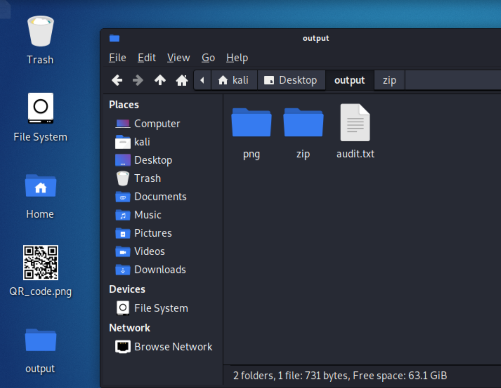
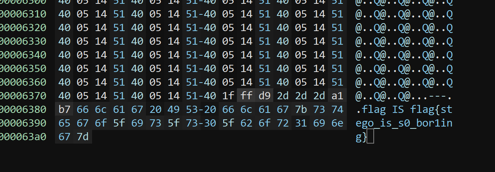
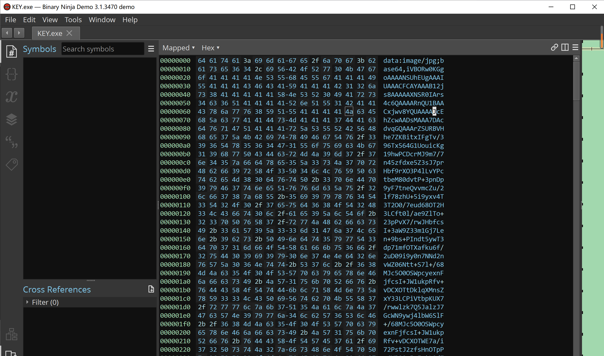
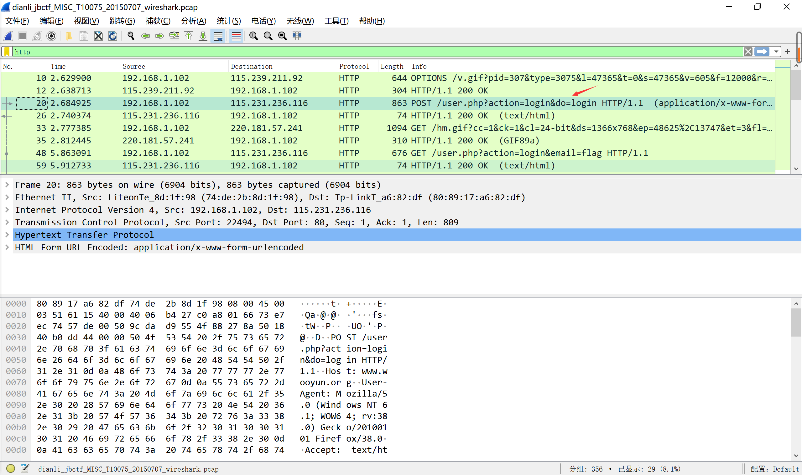

# Misc
## 签到
白送。flag{buu_ctf}

## 金三胖
忠！诚！

给一个gif文件，用Stegsolve查看gif单个图片，组合得flag：flag{he11ohongke}

## 二维码
给一个二维码。拖进kali里用foremost解，得一个压缩包。试直接打开，需要解压密码，由里面txt文件名猜测是四位数字密码。用ARCHPR暴力破解密码。得密码7639，打开压缩包得flag：CTF{vjpw_wnoei}

## 你竟然赶我走
给一个jpg文件。用binary ninja的十六进制编辑器打开，拖到最后得flag：flag{stego_is_s0_bor1ing}

## N种方法解决
给一个exe文件。用binary ninja的十六进制编辑器打开。

将内容复制到浏览器打开，是一个二维码。扫码可得flag：KEY{dca57f966e4e4e31fd5b15417da63269}

## 大白
> 看不到图？ 是不是屏幕太小了

给一个png文件。打开一眼看出图片截过。用binary ninja打开，修改图片高度，得flag：flag{He1l0_d4_ba1}

## 基础破解
> 给你一个压缩包，你并不能获得什么，因为他是四位数字加密的哈哈哈哈哈哈哈。。。不对= =我说了什么了不得的东西。。

给一个压缩包。一样用ARCHPR暴力破解，得密码2563。解压得一串编码ZmxhZ3s3MDM1NDMwMGE1MTAwYmE3ODA2ODgwNTY2MWI5M2E1Y30=

猜测是base64，扔进CyberChef得flag：flag{70354300a5100ba78068805661b93a5c}

## 乌镇峰会种图
> 乌镇互联网大会召开了，各国巨头汇聚一堂，他们的照片里隐藏着什么信息呢？（答案格式：flag｛答案｝，只需提交答案）

给一个jpg文件。用binary ninja的十六进制编辑器打开，末尾即是flag：flag{97314e7864a8f62627b26f3f998c37f1}

## 文件中的秘密
> 小明经常喜欢在文件中藏一些秘密。时间久了便忘记了，你能帮小明找到该文件中的秘密吗？

给一个jpeg文件。右键属性备注中有flag：flag{870c5a72806115cb5439345d8b014396}

## wireshark
> 黑客通过wireshark抓到管理员登陆网站的一段流量包（管理员的密码即是答案) 注意：得到的 flag 请包上 flag{} 提交

用wireshark打开附件，过滤器中输入http，可以发现有个好像是登录的东西。

追踪http流，可得密码ffb7567a1d4f4abdffdb54e022f8facd，也即flag：flag{ffb7567a1d4f4abdffdb54e022f8facd}