# Reverse
## easyre
> 非常简单的逆向

下载附件并解压，是一个.exe文件。用Exeinfo查壳

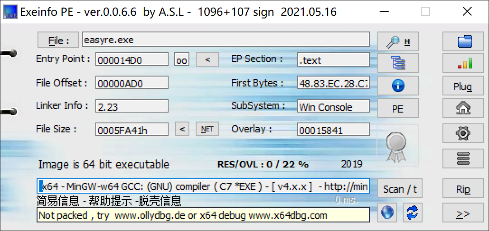

无壳，64位。用IDA打开。

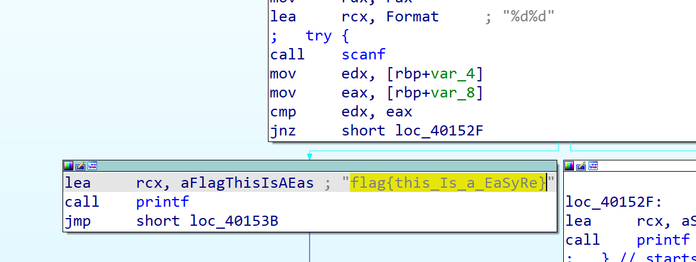

发现flag：flag{this_Is_a_EaSyRe}

## reverse1
> reverse1 注意：得到的 flag 请包上 flag{} 提交

下载附件并解压，是一个.exe文件。用Exeinfo查壳

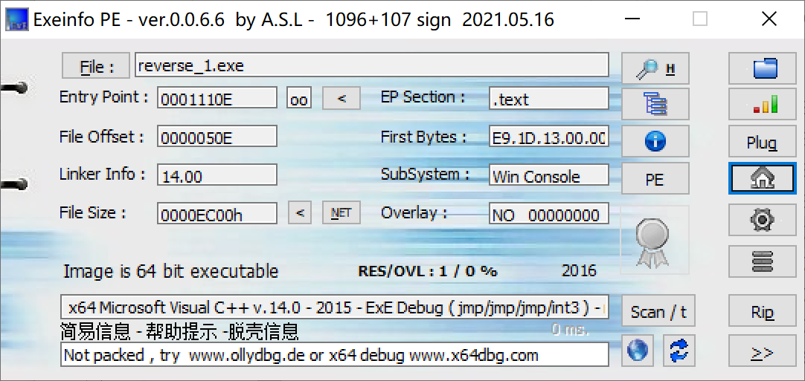

无壳，64位。用IDA打开。shift+f12再搜索flag，找到一个字符串"input the flag"，双击点进。

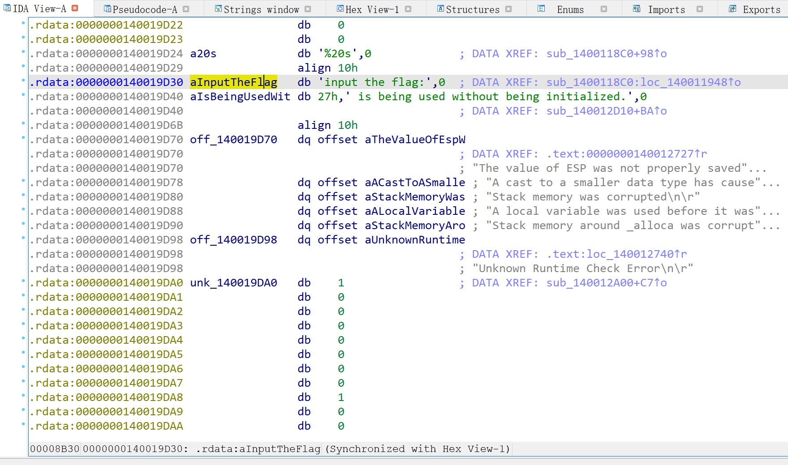

选中按x进入，f5生成伪代码

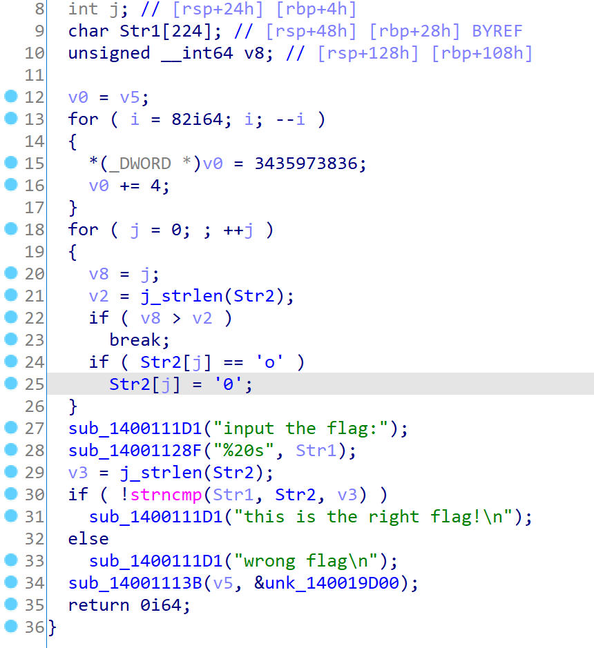

经推测，flag应该就是Str2，不过其中的'o'要变成'0'。点击Str2，可以看到为{hello_world}。最终的flag应为：flag{hell0_w0rld}

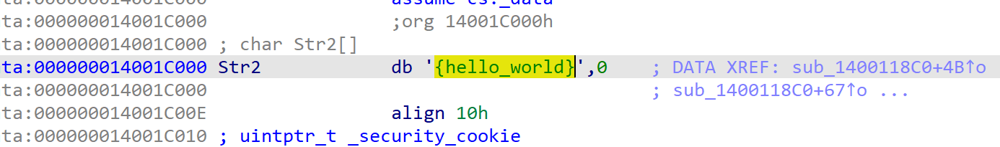

## reverse2
> reverse2 注意：得到的 flag 请包上 flag{} 提交

下载附件并解压。用Exeinfo查壳

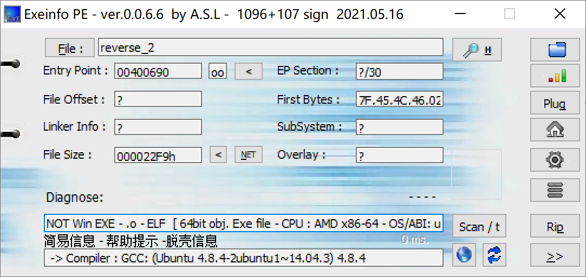

无壳，64位。用IDA打开。

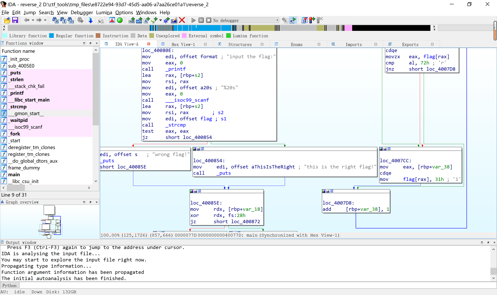

f5生成伪代码后点进flag

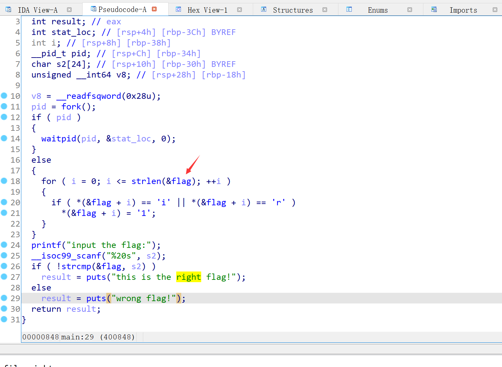
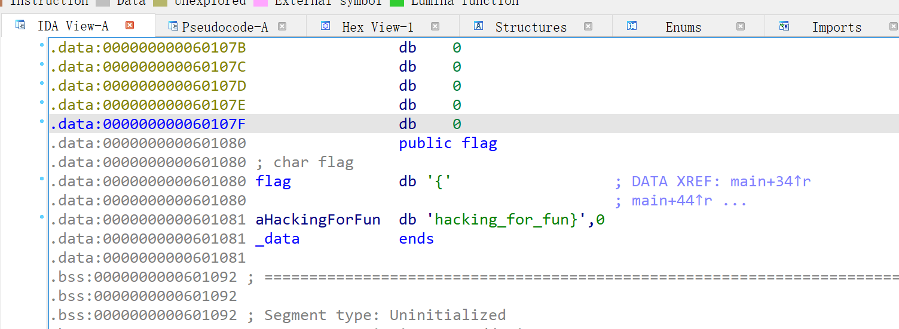

对伪代码审计发现，最终的flag对{hacking_for_fun}的'i'和'r'都替换成了'1'。于是flag为：flag{hack1ng_fo1_fun}

## reverse3
> reverse3 注意：得到的 flag 请包上 flag{} 提交

下载附件并解压。用Exeinfo查壳

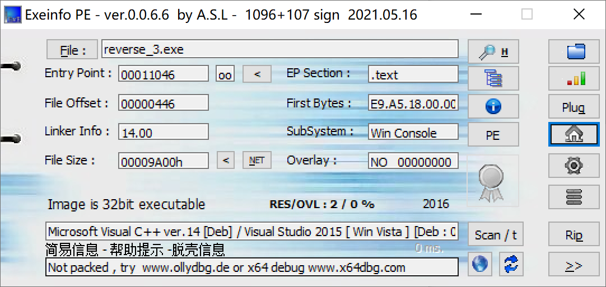

无壳，32位。用ida打开，shift+f12打开字符串窗口

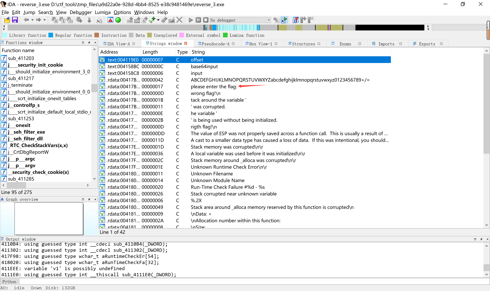

点击进入，按x追踪，f5生成伪代码

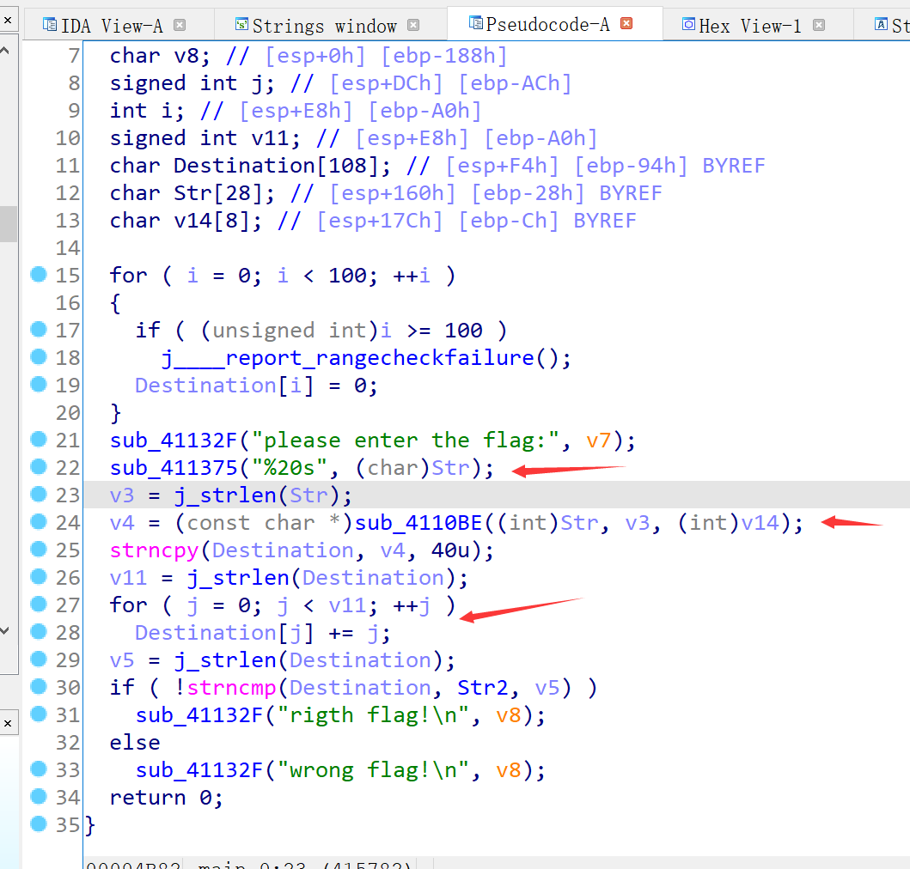

审计伪代码可知，读入Str后，会经过一个叫sub_4110BE的函数处理，再经过一个for循环处理，最终处理出来的结果就是Str2。点进去可以看到Str2是'e3nifIH9b_C@n@dH'

双击进入sub_4110BE函数，里面还有一层叫sub_411AB0的函数，再次双击进入。

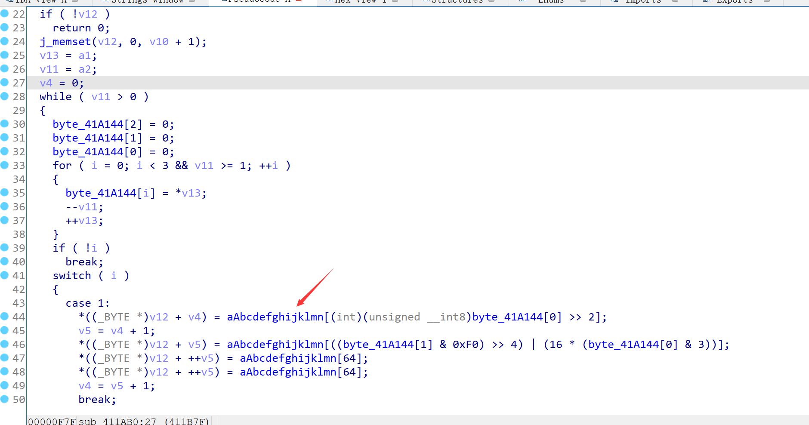

看起来有点熟悉，似乎是base64？点进aAbcdefghijklmn看看

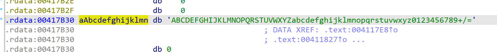

应该是了。尝试一下

```python
import base64

Str2 = 'e3nifIH9b_C@n@dH'
Str2_c = ''
for i in range(len(Str2)):
    Str2_c += chr(ord(Str2[i]) - i)

print(base64.b64decode(Str2_c))
```

输出是b'{i_l0ve_you}'，于是flag为：flag{i_l0ve_you}

## 内涵的软件
> 图片有内涵，exe也可以有内涵，也许你等不到答案，赶快行动起来吧！！！ 注意：得到的 flag 请包上 flag{} 提交

没什么营养的题，ida打开就得到了flag：DBAPP{49d3c93df25caad81232130f3d2ebfad}（只不过记得将DBAPP改成flag）

## 新年快乐
> 过年了要不做个逆向题庆祝一下新年？说不定会有惊喜哦！注意：flag并非是flag{XXX}形式，就是一个字符串，考验眼力的时候到了！ 注意：得到的 flag 请包上 flag{} 提交

下载附件并解压。用Exeinfo查壳

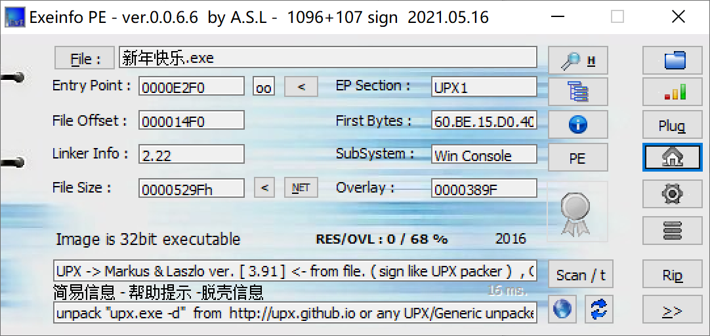

有壳，32位。拖到kali里用命令 `upx -d 新年快乐.exe` 脱壳。

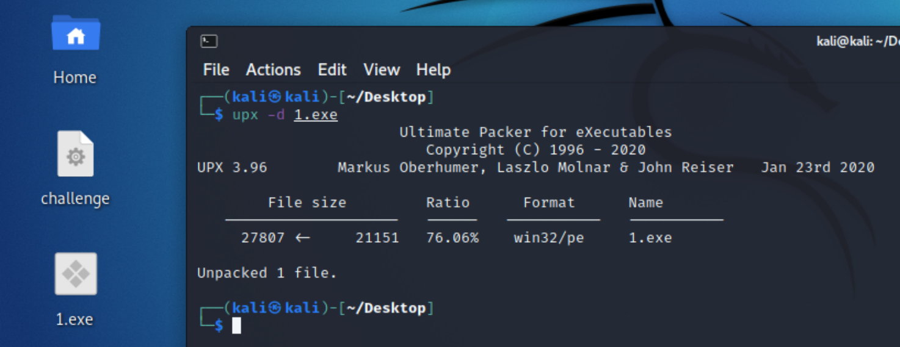

脱完壳后用ida打开。

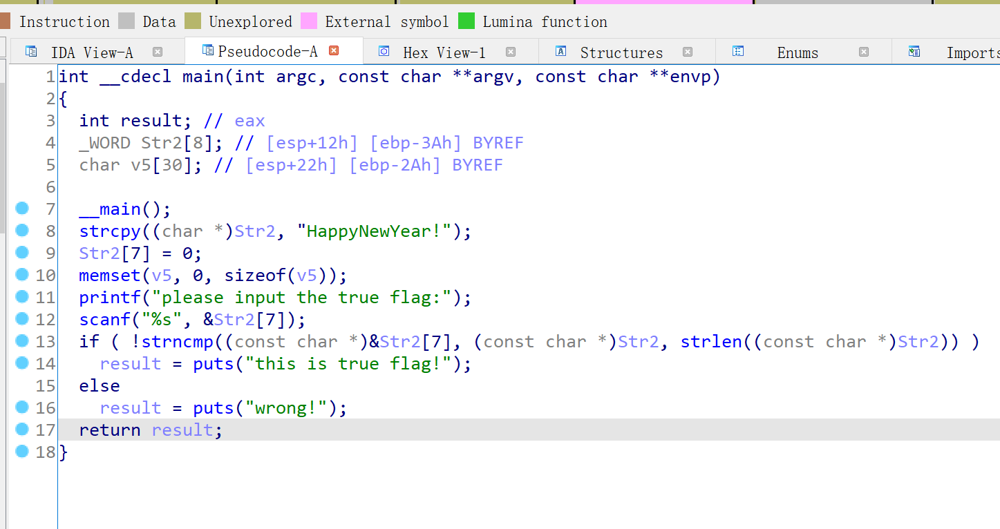

生成的伪代码似乎有点错误，查阅资料发现可能是堆栈不平衡导致的。尝试手动脱壳。

用x32dbg打开该exe文件，在断点处看到pushad。

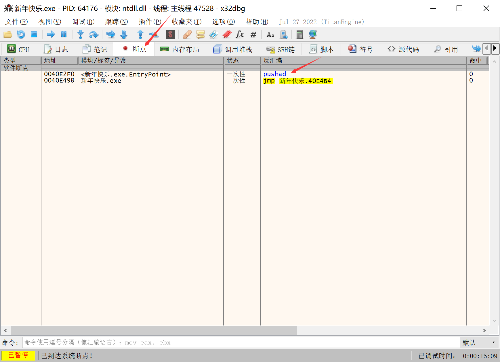

点进去

flag就是flag{HappyNewYear!}