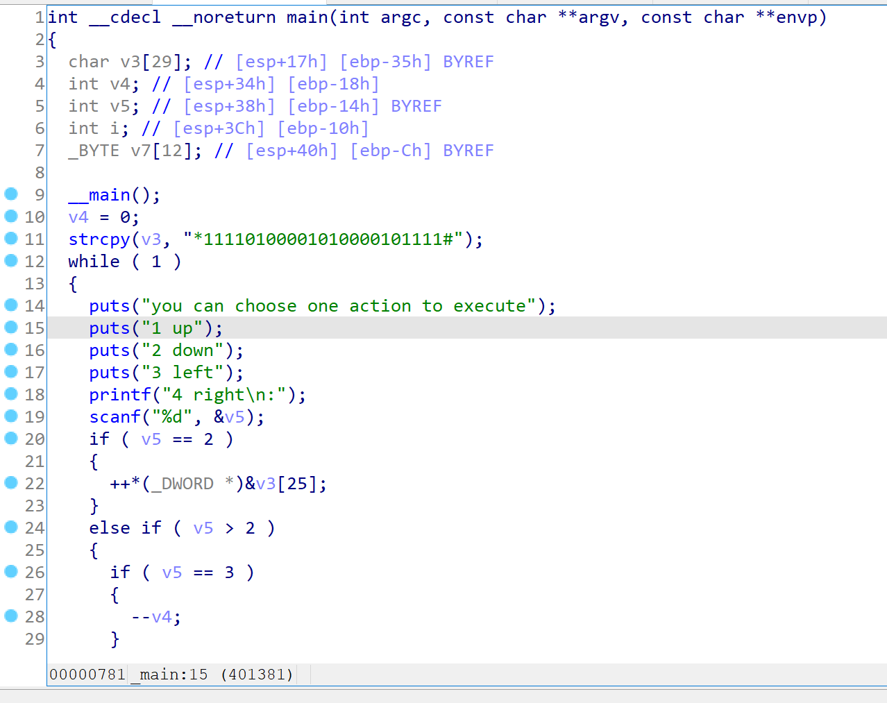

# Reverse
## easyre
> 非常简单的逆向

下载附件并解压，是一个.exe文件。用Exeinfo查壳


无壳，64位。用IDA打开。


发现flag：flag{this_Is_a_EaSyRe}

## reverse1
> reverse1 注意：得到的 flag 请包上 flag{} 提交

下载附件并解压，是一个.exe文件。用Exeinfo查壳


无壳，64位。用IDA打开。shift+f12再搜索flag，找到一个字符串"input the flag"，双击点进。


选中按x进入，f5生成伪代码


经推测，flag应该就是Str2，不过其中的'o'要变成'0'。点击Str2，可以看到为{hello_world}。最终的flag应为：flag{hell0_w0rld}


## reverse2
> reverse2 注意：得到的 flag 请包上 flag{} 提交

下载附件并解压。用Exeinfo查壳


无壳，64位。用IDA打开。


f5生成伪代码后点进flag


对伪代码审计发现，最终的flag对{hacking_for_fun}的'i'和'r'都替换成了'1'。于是flag为：flag{hack1ng_fo1_fun}

## reverse3
> reverse3 注意：得到的 flag 请包上 flag{} 提交

下载附件并解压。用Exeinfo查壳


无壳，32位。用ida打开，shift+f12打开字符串窗口


点击进入，按x追踪，f5生成伪代码


审计伪代码可知，读入Str后，会经过一个叫sub_4110BE的函数处理，再经过一个for循环处理，最终处理出来的结果就是Str2。点进去可以看到Str2是'e3nifIH9b_C@n@dH'

双击进入sub_4110BE函数，里面还有一层叫sub_411AB0的函数，再次双击进入。


看起来有点熟悉，似乎是base64？点进aAbcdefghijklmn看看


应该是了。尝试一下

```python
import base64

Str2 = 'e3nifIH9b_C@n@dH'
Str2_c = ''
for i in range(len(Str2)):
    Str2_c += chr(ord(Str2[i]) - i)

print(base64.b64decode(Str2_c))
```

输出是b'{i_l0ve_you}'，于是flag为：flag{i_l0ve_you}

## 内涵的软件
> 图片有内涵，exe也可以有内涵，也许你等不到答案，赶快行动起来吧！！！ 注意：得到的 flag 请包上 flag{} 提交

没什么营养的题，ida打开就得到了flag：DBAPP{49d3c93df25caad81232130f3d2ebfad}（只不过记得将DBAPP改成flag）

## 新年快乐
> 过年了要不做个逆向题庆祝一下新年？说不定会有惊喜哦！注意：flag并非是flag{XXX}形式，就是一个字符串，考验眼力的时候到了！ 注意：得到的 flag 请包上 flag{} 提交

下载附件并解压。用Exeinfo查壳


有壳，32位。拖到kali里用命令 `upx -d 新年快乐.exe` 脱壳。


脱完壳后用ida打开。


生成的伪代码似乎有点错误，查阅资料发现可能是堆栈不平衡导致的。尝试手动脱壳。

用x32dbg打开该exe文件，在断点处看到pushad。


点进去

flag就是flag{HappyNewYear!}

## xor
> or的敌人，and 有个兄弟叫or,or有个敌人叫xor，那么你能帮助or战胜他的敌人xor吗，xor的奥秘就在附件中，开始战斗吧！ 注意：得到的 flag 请包上 flag{} 提交

无壳64位。用ida64打开，f5生成伪代码。


很显然是对flag做邻位xor操作了。双击global，再双击aFKWOXZUPFVMDGH进入，找到一个数组。


将这个数组调出来，用下面的python脚本即能跑出flag：flag{QianQiuWanDai_YiTongJiangHu}

```python
s = [
    0x66, 0x0A, 0x6B, 0x0C, 0x77, 0x26, 0x4F, 0x2E, 0x40, 0x11,
    0x78, 0x0D, 0x5A, 0x3B, 0x55, 0x11, 0x70, 0x19, 0x46, 0x1F,
    0x76, 0x22, 0x4D, 0x23, 0x44, 0x0E, 0x67, 0x06, 0x68, 0x0F,
    0x47, 0x32, 0x4F, 0x00
]

for i in reversed(range(1, len(s))):
    s[i] ^= s[i - 1]

for i in s:
    print(chr(i), end='')
```

（xor是从前向后加密的，解密要从后向前）

## helloword
> 有难的题目，也就有简单的题目，就像程序员一辈子编写的第一个程序，极有可能是helloword，它很普通，但是也很让人怀念。你猜这题flag在哪里？让我们怀念第一次编写的easy程序吧！ 注意：得到的 flag 请包上 flag{} 提交

附件是一个.apk文件。反编译后再sources.com.example.helloword.MainActivity.java里面可以找到flag：flag{7631a988259a00816deda84afb29430a}

## 不一样的flag
> 是不是做习惯了常规的逆向题目？试试这道题，看你在能不能在程序中找到真正的flag！注意：flag并非是flag{XXX}形式，就是一个’字符串‘，考验眼力的时候到了！ 注意：得到的 flag 请包上 flag{} 提交

无壳32位。ida32打开，f5反汇编。



开头就有一个可疑的字符串 "*11110100001010000101111#" 。由下面的几个puts，怀疑是走迷宫。


由最后这两个判断可知，1是墙，#是终点，而且每行5个字符。故迷宫如下

```
*1111
01000
01010
00010
1111#
```

走迷宫很显然flag为：flag{222441144222}

## Java逆向解密
> 程序员小张不小心弄丢了加密文件用的秘钥，已知还好小张曾经编写了一个秘钥验证算法，聪明的你能帮小张找到秘钥吗？ 注意：得到的 flag 请包上 flag{} 提交

给一个.class附件。用jd-gui反编译。


非常简单的逻辑，以下是解题脚本

```python
key = [
    180, 136, 137, 147, 191, 137, 147, 191, 148, 136,
    133, 191, 134, 140, 129, 135, 191, 65
]

for k in key:
    print(chr(k - 64 ^ 0x20), end='')
```

输出：This_is_the_flag_!。故flag为：flag{This_is_the_flag_!}

## [GXYCTF2019]luck_guy
> 得到的 flag 请包上 flag{} 提交。

无壳64位。用ida64打开，f5生成伪代码，双击进入patch_me函数，再次双击进入get_flag函数。


以下是解题脚本，得flag：GXY{do_not_hate_me}

```python
flag = 'GXY{do_not_'
f2 = 'icug`of\x7F'
for j in range(8):
    if j % 2 == 1:
        flag += chr(ord(f2[j]) - 2)
    else:
        flag += chr(ord(f2[j]) - 1)

print(flag)
```

## [BJDCTF2020]JustRE

无壳32位。用ida打开，shift+f12查找字符串，看到有个比较可疑的字符串。


点进去后x追踪，f5生成伪代码。


很显然flag为：BJD{1999902069a45792d233ac}

## 刮开有奖

无壳32位。用ida32打开。