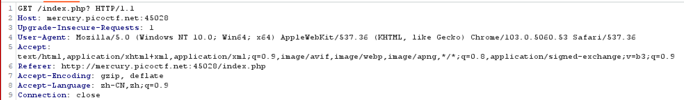
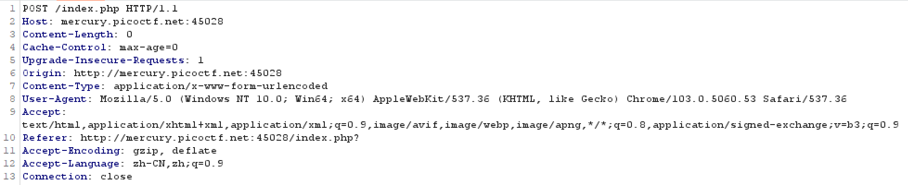
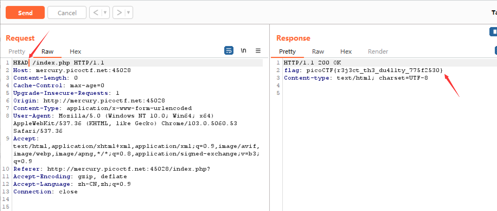
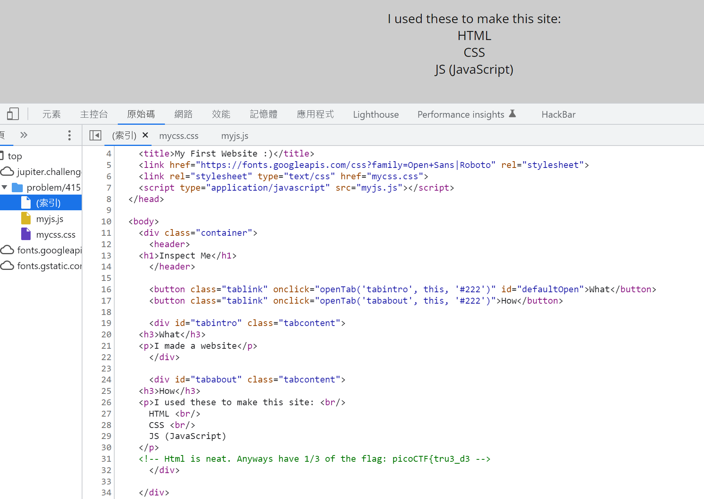
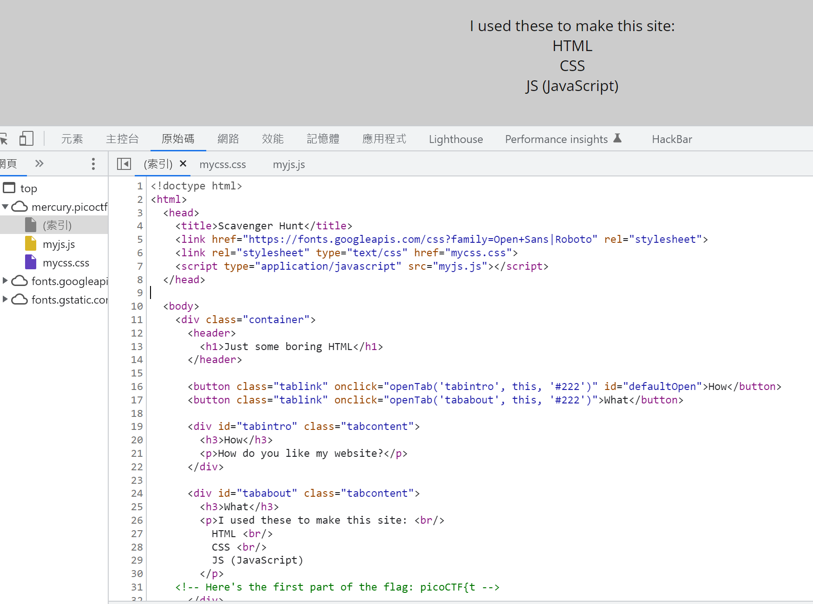
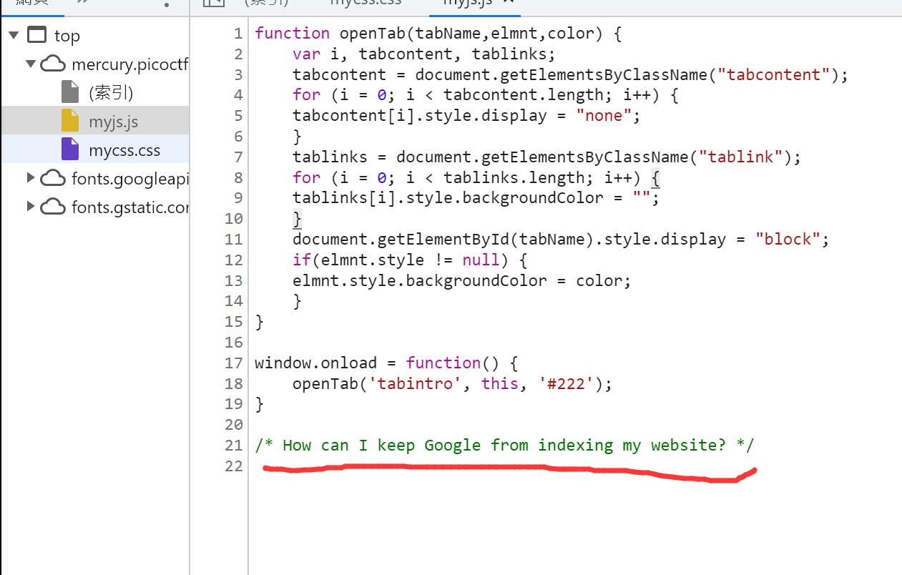
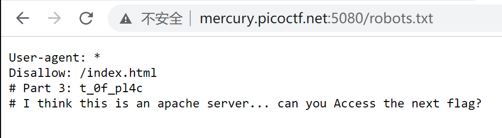
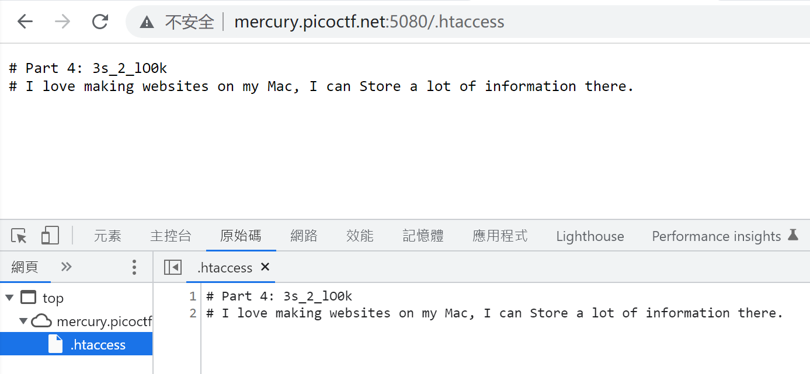
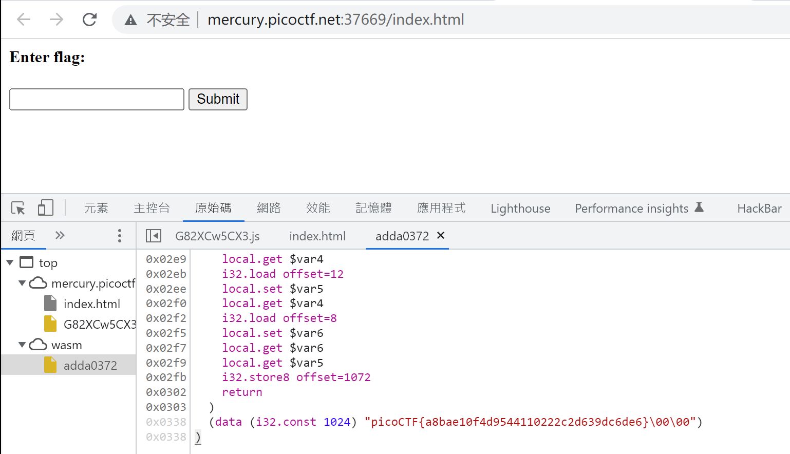

# Web
## GET aHEAD
> Find the flag being held on this server to get ahead of the competition 
> http://mercury.picoctf.net:45028/

> Maybe you have more than 2 choices
> 
> Check out tools like Burpsuite to modify your requests and look at the responses

用Burp Suite抓包。发现Choose Red的请求方法是GET，Choose Blue的请求方法是POST。

查阅资料可知HTTP的请求方法一共有17种（[http请求方式有几种](https://blog.csdn.net/qq_52143560/article/details/124595925)）
1. GET 请求指定的页面信息，并返回实体主体。
2. HEAD 类似于 get 请求，只不过返回的响应中没有具体的内容，用于获取报头
3. POST 向指定资源提交数据进行处理请求（例如提交表单或者上传文件）。数据被
包含在请求体中。POST 请求可能会导致新的资源的建立和/或已有资源的修改。
4. PUT 从客户端向服务器传送的数据取代指定的文档的内容。
5. DELETE 请求服务器删除指定的页面。
6. CONNECT HTTP/1.1 协议中预留给能够将连接改为管道方式的代理服务器。
7. OPTIONS 允许客户端查看服务器的性能。
8. TRACE 回显服务器收到的请求，主要用于测试或诊断。
9. PATCH 实体中包含一个表，表中说明与该 URI 所表示的原内容的区别。
10. MOVE 请求服务器将指定的页面移至另一个网络地址。
11. COPY 请求服务器将指定的页面拷贝至另一个网络地址。
12. LINK 请求服务器建立链接关系。
13. UNLINK 断开链接关系。
14. WRAPPED 允许客户端发送经过封装的请求。
15. LOCK 允许用户锁定资源，比如可以再编辑某个资源时将其锁定，以防别人同时对其进行编辑。
16. MKCOL 允许用户创建资源
17. Extension-mothed 在不改动协议的前提下，可增加另外的方法。

注：但是常见的就只有五种分别是 get、post、put、delete、options

由题目 GET aHEAD 提示或许修改请求为HEAD会有效果。

果然，得flag：picoCTF{r3j3ct_th3_du4l1ty_775f2530}

## Cookies
> Who doesn't love cookies? Try to figure out the best one. 
> http://mercury.picoctf.net:54219/

## Insp3ct0r
> Kishor Balan tipped us off that the following code may need inspection: 
> https://jupiter.challenges.picoctf.org/problem/41511/

> How do you inspect web code on a browser?
> 
> There's 3 parts

点开链接，按How，并F12查看源码。

根据提示按顺序看html，css，js文件，得flag：picoCTF{tru3_d3t3ct1ve_0r_ju5t_lucky?832b0699}

## Scavenger Hunt
> There is some interesting information hidden around this site http://mercury.picoctf.net:5080/. Can you find it?

> You should have enough hints to find the files, don't run a brute forcer.

点开链接，按What，并F12查看源码。

按照提示得到flag的部分：`picoCTF{t`、`h4ts_4_l0`

在js文件里看到这样一句话：如何防止Google索引到网站。

在url后加 /robots.txt，找到flag的第三部分：`t_0f_pl4c`。同时有一句话：apache服务器，如何Access到下一个flag。

.htaccess文件是Apache服务器中的一个配置文件，它负责相关目录下的网页配置。通过.htaccess文件，可以帮我们实现：网页301重定向、自定义404错误页面、改变文件扩展名、允许/阻止特定的用户或者目录的访问、禁止目录列表、配置默认文档等功能。

因此，在url后加 /.htaccess，找到flag的第四部分：`3s_2_lO0k`

DS_Store，英文全称是 Desktop Services Store（桌面服务存储），开头的 DS 是 Desktop Services（桌面服务） 的缩写。它是一种由macOS系统自动创建的隐藏文件，存在于每一个用「访达」打开过的文件夹下面。

DS_Store 文件的主要作用，是存储当前文件夹在桌面显示相关方面的一些自定义属性，包括文件图标的位置、文件夹上次打开时窗口的大小、展现形式和位置等。这有助于保留为特定文件夹配置的设置，例如，将桌面文件夹设置为查看按名称排序的图标，同时将下载文件夹配置为将文件显示为列表并按日期排序，最近修改的先显示。

因此，在url后加 /.DS_Store，找到flag的最后一部分：`_35844447}`

组合flag得：picoCTF{th4ts_4_l0t_0f_pl4c3s_2_lO0k_35844447}

## Some Assembly Required 1
> http://mercury.picoctf.net:37669/index.html

进入链接，F12，查看源码。在wasm文件夹下的adda0372文件的最底部得flag：picoCTF{a8bae10f4d9544110222c2d639dc6de6}

## More Cookies
> I forgot Cookies can Be modified Client-side, so now I decided to encrypt them! 
> http://mercury.picoctf.net:21553/

> https://en.wikipedia.org/wiki/Homomorphic_encryption
> 
> The search endpoint is only helpful for telling you if you are admin or not, you won't be able to guess the flag name.

