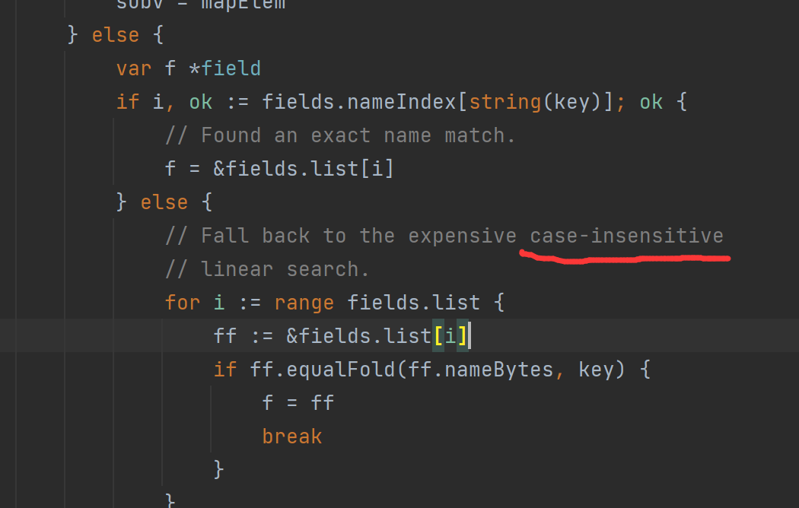
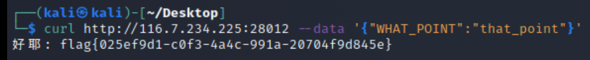

# 入队考试2022
## Web/简单的序列
> 这里一点那里一点，好耶！

给了一个main.go附件，内容如下
```go
package main

import (
	"encoding/json"
	"fmt"
	"io"
	"log"
	"net/http"
	"os"
	"strings"
)

type importantStuff struct {
	Whatpoint string `json:"what_point"`
}

func main() {
	flag, err := os.ReadFile("flag.txt")
	if err != nil {
		panic(err)
	}

	http.HandleFunc("/", func(w http.ResponseWriter, r *http.Request) {
		switch r.Method {
		case http.MethodGet:
			fmt.Fprint(w, "你好世界")
			return
		case http.MethodPost:
			body, err := io.ReadAll(r.Body)
			if err != nil {
				fmt.Fprintf(w, "寄了")
				return
			}

			if strings.Contains(string(body), "what_point") || strings.Contains(string(body), "\\") {
				fmt.Fprintf(w, "寄了")
				return
			}

			var whatpoint importantStuff
			err = json.Unmarshal(body, &whatpoint)
			if err != nil {
				fmt.Fprintf(w, "寄了")
				return
			}

			if whatpoint.Whatpoint == "that_point" {
				fmt.Fprintf(w, "好耶: %s", flag)
				return
			} else {
				fmt.Fprintf(w, "寄了")
				return
			}
		default:
			fmt.Fprint(w, "不许")
			return
		}
	})

	log.Fatal(http.ListenAndServe(":9999", nil))

}
```

要发送一个json数据，经过 `strings.Contains(string(body), "what_point") || strings.Contains(string(body), "\\")` 判断，不允许 body 中出现 "what_point" 和 "\\"。并经由 `err = json.Unmarshal(body, &whatpoint)` 使得该json数据被 unmarshal 后有 `whatpoint.Whatpoint == "that_point"` 。

注意到有 `var whatpoint importantStuff`，而 
```go
type importantStuff struct {
	Whatpoint string `json:"what_point"`
}
```
因此 key 又不得不是 `what_point` 。

查阅 encoding/json/decode.go 的源码，发现如下



这说明在获取value时，key 的比较是大小写不敏感的。因此可以如下获得flag
```
curl http://116.7.234.225:28012 --data '{"WHAT_POINT":"that_point"}'
```

