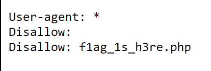

# Web
## view_source
> X老师让小宁同学查看一个网页的源代码，但小宁同学发现鼠标右键好像不管用了。

进入题目场景，F12，得flag：cyberpeace{006f3276780e0e8c27a380613202d071}。

## get_post
> X老师告诉小宁同学HTTP通常使用两种请求方法，你知道是哪两种吗？

## backup
> X老师忘记删除备份文件，他派小宁同学去把备份文件找出来,一起来帮小宁同学吧！

常见的备份文件后缀名有：.git .svn .swp .~ .bak .bash_history .bkf

可以逐个尝试。在网址后拼接 /index.php.bak 会下载一个文件，打开文件里面就有flag：Cyberpeace{855A1C4B3401294CB6604CCC98BDE334}

## robots
> X老师上课讲了Robots协议，小宁同学却上课打了瞌睡，赶紧来教教小宁Robots协议是什么吧。

进入题目场景，网址后加 /robots.txt，会看到隐藏了一个文件 f1ag_1s_h3re.php

在原网址后加 /f1ag_1s_h3re.php，可得flag: cyberpeace{db38bb24596f376eb79b5ad90659edc7}

## cookie
> X老师告诉小宁他在cookie里放了些东西，小宁疑惑地想：‘这是夹心饼干的意思吗？’

进入题目场景。

Cookie是由服务端产生，保存在客户端。记录了用户的相关信息，如身份认证码、密码、网页浏览记录、逗留时间、点击记录等，当用户再次与服务器连接时，浏览器读取Cookie信息并发送给Web网站。

进入 /index.php，F12，可以看到cookie

进入 /cookie.php，F12，可得flag：cyberpeace{7ba15df3a906dc94d9205ff839d8b2cc}

## disabled_button
> X老师今天上课讲了前端知识，然后给了大家一个不能按的按钮，小宁惊奇地发现这个按钮按不下去，到底怎么才能按下去呢？

进入场景，F12，可以看到按钮被disabled了。

将disabled删除，按下按钮，可得flag：cyberpeace{b3b074954a8b7c4cc5fbea95fcfa5eba}

## weak_auth
> 小宁写了一个登陆验证页面，随手就设了一个密码。

