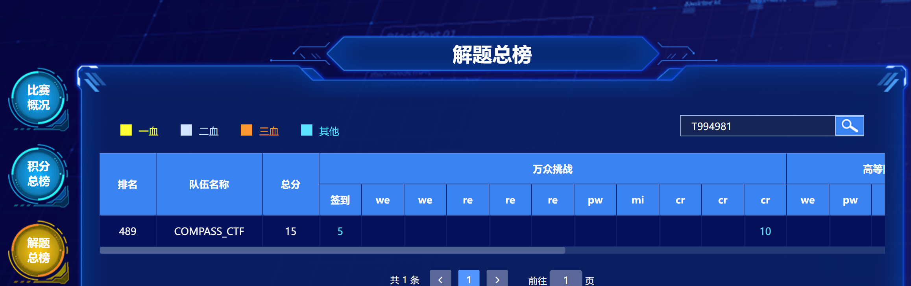
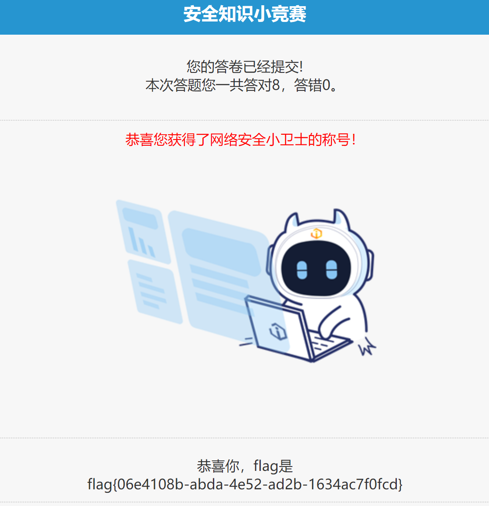
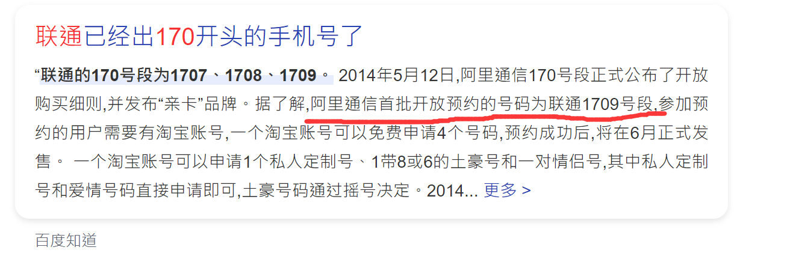
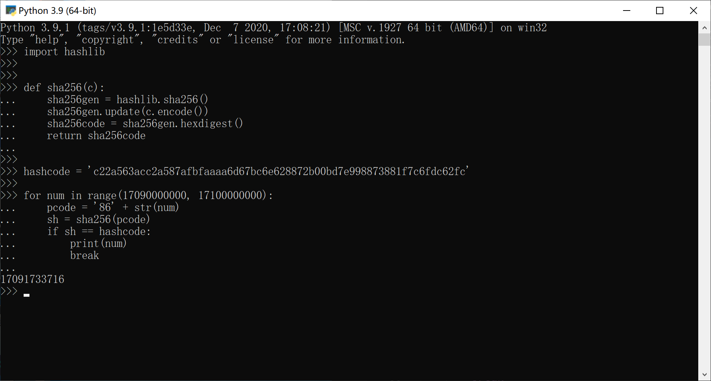

# COMPASS_CTF 战队 WRITEUP
## 战队信息
战队名称：COMPASS_CTF
战队排名：301
## 解题情况



所有题目均由队员 U7822110 所解决

### 1 签到
> 题目内容：一起来参与安全知识小竞赛。

* 操作内容

下发环境后是安全竞赛，一共8道题。可以上网搜每道题的答案，也可以不断试错找到答案。

每道题的答案分别是：

1. ZUC
2. 使机器具有能够获取新知识学习新技巧的能力
3. 数据安全法就是要求数据各自保存，互不交流
4. 2的96次方
5. 相关安全保护机制已经成熟
6. 12321
7. SHA256
8. 内存隔离



* flag值：

flag{06e4108b-abda-4e52-ad2b-1634ac7f0fcd}


## 11 crypto091
> 小A鼓起勇气向女神索要电话号码，但女神一定要考考他。女神说她最近刚看了一篇发表于安全顶会USENIX Security 2021的论文，论文发现苹果AirDrop隔空投送功能的漏洞，该漏洞可以向陌生人泄露AirDrop发起者或接收者的电话号码和电子邮箱。小A经过一番努力，获得了女神手机在AirDrop时传输的手机号哈希值，但再往下就不会了，你能继续帮助他吗？小A只记得女神手机号是170号段首批放号的联通号码。
Hash：c22a563acc2a587afbfaaaa6d67bc6e628872b00bd7e998873881f7c6fdc62fc
>
> flag格式：flag{13位电话号码（纯数字，含国家代码）}

* 操作内容



上网查到170号段首批放号的联通号码开头是1709，于是通过下面的脚本能获取女神的手机号。

```python
import hashlib


def sha256(c):
    sha256gen = hashlib.sha256()
    sha256gen.update(c.encode())
    sha256code = sha256gen.hexdigest()
    return sha256code


hashcode = 'c22a563acc2a587afbfaaaa6d67bc6e628872b00bd7e998873881f7c6fdc62fc'

for num in range(17090000000, 17100000000):
    pcode = '86' + str(num)
    sh = sha256(pcode)
    if sh == hashcode:
        print(num)
        break
```



跑出来是17091733716。由此可得flag

* flag值：
  
flag{8617091733716}


